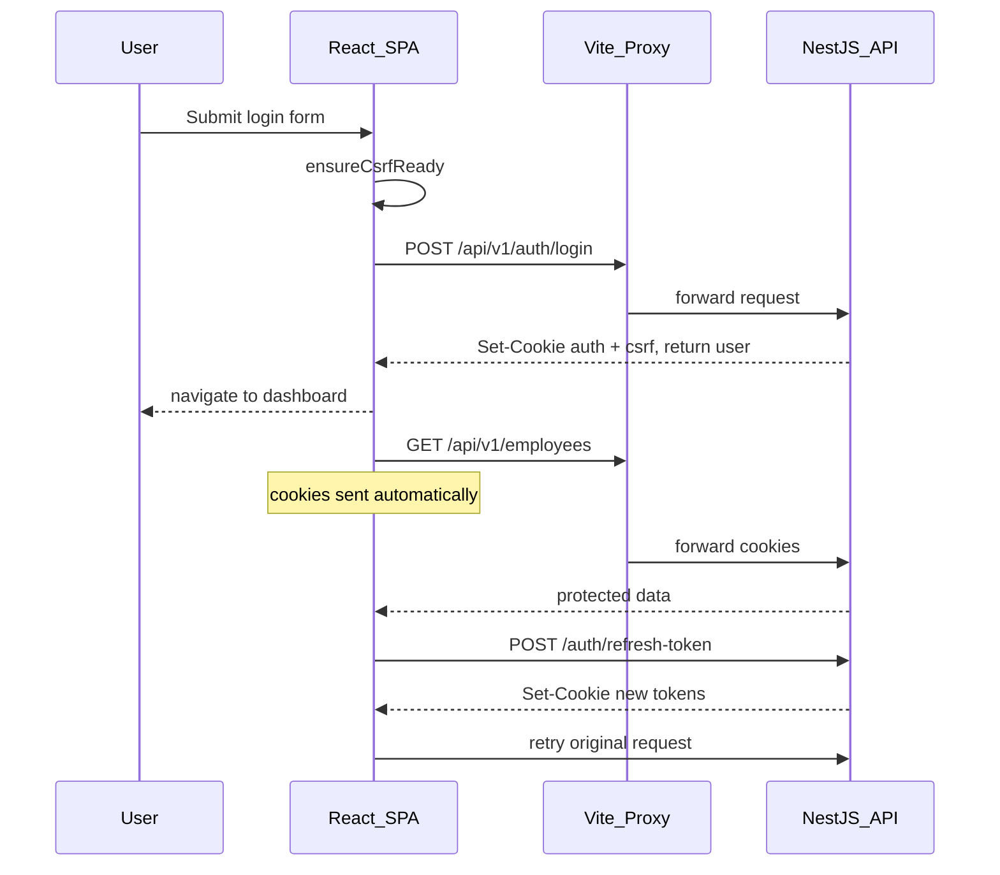

# Authentication in HRIS — Full Walkthrough

This app uses **HttpOnly cookie authentication**: short-lived JWT access tokens and opaque refresh tokens are set exclusively via `Set-Cookie` headers. The frontend never reads or stores access/refresh tokens in JavaScript-accessible storage. Sessions are restored via `GET /auth/me` with cookies sent automatically (on non-public routes).

**Demo credentials** (after `npm run prisma:seed` in `BE/`): `admin@hris.com` / `password`

---

# FE — All Frontend Notes

## FE Summary

- Browser uses cookie-based auth; FE never reads or stores access or refresh tokens
- FE stores only `tenantId` and CSRF token in memory for request headers
- FE relies on Vite dev proxy so browser requests stay same-origin in development
- FE restores a session with `GET /auth/me` when not on a public auth page
- FE enforces UI-level gating with Redux auth state and permission checks

## FE Compatibility

| Capability | FE Status |
|------------|-----------|
| Login / logout / refresh / me / csrf | Implemented |
| Register | Implemented, no auto-login |
| Change password | Not wired |
| Forgot / reset password | UI + API calls exist, but BE is still stubbed |
| Verify / resend email | Endpoint constants exist only; no API wiring or UI |

## FE Request Flow



## Step 1 — Environment + Vite Dev Proxy

`FE/vite.config.ts` proxies `/api` using `VITE_DEV_PROXY_TARGET` from `FE/.env` so the browser treats API calls as same-origin. Cookies set by the API are stored and sent automatically.

```typescript
server: {
  proxy: {
    '/api': { target: proxyTarget, changeOrigin: true },
  },
},
```

**Browser dev** — `FE/.env`:

```env
# Leave empty so requests use the Vite proxy (same-origin cookies + CSRF)
VITE_API_BASE_URL=
VITE_DEV_PROXY_TARGET=http://localhost:3000
```

- Empty `VITE_API_BASE_URL` means `httpClient` uses `/api/v1` through the Vite proxy.
- `VITE_DEV_PROXY_TARGET` controls where the Vite dev proxy forwards `/api` requests.
- Do **not** set `VITE_API_BASE_URL=http://localhost:3000` for normal browser dev. That makes requests cross-origin and breaks CSRF because cookies live on `:3000` while the app reads cookies on `:5173`.
- `vitest.integration.config.ts` intentionally overrides `VITE_API_BASE_URL=http://localhost:3000` for Node-based integration tests.

## Step 2 — HTTP Client

- `withCredentials: true` on the axios instance
- No `Authorization` header, and no `sessionStorage` / `localStorage` for access or refresh tokens
- `bootstrapCsrf()` / `ensureCsrfReady()` call `GET /auth/csrf` and store `csrfToken` from the response body in memory
- `readCsrfToken()` checks `document.cookie` first, then falls back to in-memory storage; Node tests use `nodeCookieJar`
- Request interceptor adds `X-CSRF-Token` on `POST` / `PUT` / `PATCH` / `DELETE`
- Request interceptor also adds `X-Tenant-Id` from in-memory auth state
- Response interceptor syncs the in-memory CSRF value from `document.cookie` after successful responses so login-triggered CSRF rotation stays in sync
- `clearSession()` clears in-memory `tenantId` and CSRF token
- 401 interceptor calls the registered `refreshSession` handler and retries the original request, except for paths in `NO_REFRESH_RETRY_PATHS`
- `setTenantId()` / `getTenantId()` keep tenant context in memory only

## Step 3 — Auth API

All mutating auth functions call `ensureCsrfReady()` before `POST` so the CSRF token is refreshed and any legacy cookie path is cleared server-side.

| Function | Endpoint | Notes |
|----------|----------|-------|
| `login` | `POST /auth/login` | `ensureCsrfReady()` then POST; returns `{ user }` only |
| `logout` | `POST /auth/logout` | `ensureCsrfReady()` then POST; clears cookies server-side |
| `refreshSession` | `POST /auth/refresh-token` | `ensureCsrfReady()` then POST; no body |
| `fetchMe` | `GET /auth/me` | Restores session; no CSRF required |
| `register` | `POST /auth/register` | `ensureCsrfReady()` then POST |
| `forgotPassword` | `POST /auth/forgot-password` | FE is wired, but the BE endpoint is still a stub |
| `resetPassword` | `POST /auth/reset-password` | FE is wired, but the BE endpoint is still a stub |

The FE endpoint constants also include `verifyEmail`, `resendVerification`, and `changePassword`, but `authApi.ts` does not wire them yet.

## Step 4 — Redux Auth Slice

**File:** `src/slices/authSlice.ts`

Session state (`user`, `isAuthenticated`, `status`, `error`) is a Redux Toolkit slice. Components read auth through exported selectors — not from `initialState` directly.

**Initial state** — the app starts logged out:

```typescript
const initialState: AuthState = {
  user: null,
  isAuthenticated: false,
  status: 'idle',
  error: null,
}
```

**Runtime updates** — handled in `extraReducers`:

| Thunk case | What it does |
|------------|--------------|
| `login.fulfilled` | Sets `user`, `state.isAuthenticated = true`, calls `setTenantId(user.tenantId)` |
| `fetchMe.pending` | Sets `state.status = 'loading'` during bootstrap session restore |
| `fetchMe.fulfilled` | Restores `user` from the cookie-backed session, `state.isAuthenticated = true` |
| `fetchMe.rejected` | Clears auth state; calls `clearSession()` and `setTenantId(null)` |
| `logout.fulfilled` | Clears `user`, `state.isAuthenticated = false`, `state.status = 'idle'` |

```typescript
// src/slices/authSlice.ts — extraReducers
.addCase(login.fulfilled, (state, action) => {
  state.status = 'succeeded'
  state.user = action.payload.user
  state.isAuthenticated = true
  setTenantId(action.payload.user.tenantId)
})
.addCase(fetchMe.pending, (state) => {
  state.status = 'loading'
})
.addCase(fetchMe.fulfilled, (state, action) => {
  state.status = 'succeeded'
  state.user = action.payload
  state.isAuthenticated = true
  setTenantId(action.payload.tenantId)
})
.addCase(fetchMe.rejected, (state) => {
  state.status = 'failed'
  state.isAuthenticated = false
  state.user = null
  clearSession()
  setTenantId(null)
})
```

`refreshSession` updates auth cookies indirectly via `Set-Cookie`; the thunk has no `extraReducers` case and does not store tokens in Redux.

**Selectors** — defined in `src/slices/authSlice.ts` (`selectIsAuthenticated`, `selectUser`, `selectAuthStatus`, `selectAuth`).

Example usage — **`src/modules/auth/AuthGate.tsx`** (all three session selectors):

```typescript
// src/modules/auth/AuthGate.tsx
import { selectAuthStatus, selectIsAuthenticated, selectUser } from '@/slices/authSlice'

const isAuthenticated = useAppSelector(selectIsAuthenticated)
const user = useAppSelector(selectUser)
const status = useAppSelector(selectAuthStatus)
```

Other consumers (subset of selectors only):

| File | Selectors used |
|------|----------------|
| `src/routes/protectedRoute.tsx` | `selectIsAuthenticated` |
| `src/layouts/AuthLayout.tsx` | `selectIsAuthenticated` |
| `src/layouts/PublicLayout.tsx` | `selectIsAuthenticated` |
| `src/modules/auth/pages/LoginPage.tsx` | `selectAuth` |
| `src/components/layout/AppHeader.tsx` | `selectUser` |
| `src/hooks/usePermission.ts` | `selectUser` |

## Step 5 — Bootstrap

```typescript
setAuthHandlers({
  refresh: async () => {
    const result = await store.dispatch(refreshSession())
    return refreshSession.fulfilled.match(result)
  },
  unauthorized: () => {
    // Refresh already failed in the HTTP interceptor; local state is cleared by fetchMe.rejected.
  },
})
void (async () => {
  await bootstrapCsrf()
  if (shouldRestoreSession()) {
    void store.dispatch(fetchMe())
  }
})()
```

`shouldRestoreSession()` returns `false` on public auth pages (`/auth/login`, `/auth/register`, `/auth/forgot-password`, `/auth/reset-password`) so the app avoids noisy `GET /auth/me` 401s on pages where a session is not expected.

## Step 6 — AuthGate

`AuthGate` shows `PageLoader` when `status === 'loading'` or when `isAuthenticated && user === null` during session restoration.

## Step 7 — Protected Routes

`ProtectedRoute` checks `isAuthenticated` from Redux and redirects unauthenticated users to `/auth/login`.

Most authenticated routes only need a valid session. Three routes also enforce explicit FE permissions:

- `/tenants` → `PERMISSIONS.tenantsManage`
- `/billing` → `PERMISSIONS.billingRead`
- `/admin/health` → `PERMISSIONS.tenantsManage`

The FE also uses `usePermission()` for navigation and page-level UI gating.

## FE Security Notes

1. FE never stores access or refresh tokens in `localStorage`, `sessionStorage`, or Redux.
2. Mutating FE requests send `X-CSRF-Token`, which must match the `hris_csrf` cookie.
3. FE reads the CSRF token from `document.cookie` or in-memory fallback only because the CSRF cookie is intentionally JS-readable for the double-submit pattern.
4. FE relies on short-lived access cookies and refresh rotation handled by the backend.

---

# FE — Main Flows

## Login Flow

1. App boot → `bootstrapCsrf()` (CSRF cookie + memory token)
2. User submits login form → `login()` calls `ensureCsrfReady()` again (refreshes CSRF, clears legacy cookie)
3. `POST /auth/login` with matching `X-CSRF-Token` header + `hris_csrf` cookie + credentials
4. BE sets HttpOnly auth cookies, rotates CSRF, returns `{ user }`
5. FE syncs CSRF memory from cookie; Redux stores user; `setTenantId(user.tenantId)`
6. Navigate to dashboard

## Session Restore Flow

1. App boots → `bootstrapCsrf()`
2. If not on a public auth page → `fetchMe()`
3. Browser sends `hris_access_token` cookie automatically
4. `GET /auth/me` succeeds → Redux populated
5. If access expired: 401 → refresh (unless skipped path) → retry `fetchMe`
6. If no session: 401 → refresh fails → `fetchMe.rejected` clears local state

This local-state cleanup is guaranteed during bootstrap restore. For other mid-session requests, the `unauthorized` handler is currently a no-op, so a failed refresh does not automatically dispatch logout yet.

## Logout Flow

1. `ensureCsrfReady()` then `POST /auth/logout` with cookies + CSRF header
2. BE revokes refresh token, clears cookies (including legacy CSRF paths)
3. Redux clears user state; `clearSession()` resets in-memory tenant and CSRF

## Register Flow

1. User submits the register form
2. `RegisterPage` calls `authApi.register()` directly
3. BE creates the user and returns the user record only
4. FE redirects to `/auth/login`

Register does not create a session, and there is no Redux `register` thunk.

---

# FE — Testing

## Frontend Unit Tests

- `bootstrap/auth.test.ts`: mocks `bootstrapCsrf`, verifies auth handlers registered and `fetchMe` dispatched
- `AuthGate.test.tsx`: loader shown when `status === 'loading'`

Run: `cd FE && npm run test -- src/bootstrap/auth.test.ts`

## Frontend Integration Tests

Uses `VITE_API_BASE_URL=http://localhost:3000` (direct API, not Vite proxy) with Node cookie-jar fallback in `httpClient`.

`FE/src/test/integration/helpers.ts` — `seedAuthFromApi()`:

1. `bootstrapCsrf()` via `httpClient`
2. `POST /auth/login` via `httpClient` (Node cookie jar)
3. `setTenantId(user.tenantId)`

`LoginPage.integration.test.tsx` submits the login form against the live API.

Run: `cd FE && npx vitest run --config vitest.integration.config.ts`

## Cypress

UI login at `http://localhost:5173` — real `Set-Cookie` flow through Vite proxy. Requires both BE and FE dev servers running.

Run: `cd FE && npm run test:e2e`

## Manual Proxy Smoke Test

With BE on `:3000` and FE on `:5173`:

1. `GET http://localhost:5173/api/v1/auth/csrf` → 200 + `csrfToken`
2. `POST http://localhost:5173/api/v1/auth/login` with `X-CSRF-Token` + cookie → 201
3. `GET http://localhost:5173/api/v1/auth/me` with session cookies → 200

---

# FE — Troubleshooting

| Symptom | Likely cause | Fix |
|---------|--------------|-----|
| **502 Bad Gateway** on `/api/v1/auth/csrf` | FE dev server down or BE not running on `:3000` | Start both: `BE npm run start:dev`, `FE npm run dev` |
| **Network Error** on login | Same as 502 — proxy target unreachable | Verify `http://localhost:3000/api/v1/health` returns 200 |
| **403 Invalid CSRF token** | `VITE_API_BASE_URL=http://localhost:3000` in browser `.env`, or stale legacy CSRF cookie at `/api/v1` | Set `VITE_API_BASE_URL=` (empty); hard refresh or clear site cookies for `localhost:5173` |
| **401 in console** on protected pages when logged out | Expected — `fetchMe` or refresh attempted without session | Normal; login with seeded credentials |
| **Invalid email or password** | Wrong credentials or DB not seeded | Run `cd BE && npm run prisma:seed`; use `admin@hris.com` / `password` |

**Both servers required for browser dev:**

```bash
# Terminal 1
cd BE && npm run start:dev

# Terminal 2
cd FE && npm run dev
```

Open `http://localhost:5173/auth/login` (not `:3000`).

---

# FE — File Reference

| File | Role |
|------|------|
| `FE/vite.config.ts` | Dev proxy for same-origin cookies |
| `FE/.env` | `VITE_API_BASE_URL=` for browser dev |
| `FE/vitest.integration.config.ts` | `VITE_API_BASE_URL=http://localhost:3000` for integration tests |
| `FE/src/services/httpClient.ts` | `withCredentials`, CSRF header and memory sync, 401 refresh, Node cookie jar |
| `FE/src/services/api/authApi.ts` | Auth API calls with `ensureCsrfReady()` |
| `FE/src/slices/authSlice.ts` | Session state; no access or refresh tokens in Redux |
| `FE/src/bootstrap/auth.ts` | CSRF bootstrap plus conditional session restore |
| `FE/src/modules/auth/AuthGate.tsx` | Loading gate during restore |
| `FE/src/test/integration/helpers.ts` | `seedAuthFromApi()` for integration tests |

---

# BE — All Backend Notes

## BE Summary

- Backend validates credentials with email and bcrypt-hashed passwords
- Backend issues a short-lived JWT access cookie and an opaque refresh cookie
- Backend protects mutating requests with CSRF validation
- Backend enforces RBAC and tenant isolation on protected routes
- Backend rotates refresh tokens and clears cookies on logout

## BE Compatibility

| Capability | BE Status |
|------------|-----------|
| Login / logout / refresh / me / csrf | Implemented |
| Register | Implemented, but no auth cookies issued |
| Change password | Implemented |
| Forgot / reset password | Stub endpoints |
| Verify / resend email | Stub endpoints |

## Step 1 — Dependencies

From `BE/package.json`:

- `@nestjs/jwt`, `@nestjs/passport`, `passport`, `passport-jwt` for JWT validation from cookies
- `cookie-parser` for incoming cookie parsing
- `bcrypt` for password hashing
- `@prisma/client` with PostgreSQL for users and refresh tokens
- `ioredis` for the logout revocation marker

## Step 2 — Environment

`BE/.env.example`:

```env
JWT_ACCESS_SECRET=change-me-access-secret-min-32-chars
JWT_ACCESS_EXPIRES=15m
JWT_REFRESH_EXPIRES=7d
CORS_ORIGIN=http://localhost:5173
COOKIE_SECURE=false
COOKIE_SAME_SITE=lax
DATABASE_URL=postgresql://...
```

Use `COOKIE_SECURE=true` in production with HTTPS.

## Step 3 — Cookie Service

`BE/src/modules/auth/auth-cookies.service.ts` centralizes cookie names and options:

| Cookie | HttpOnly | Path | Purpose |
|--------|----------|------|---------|
| `hris_access_token` | yes | `/api/v1` | Short-lived JWT |
| `hris_refresh_token` | yes | `/api/v1/auth` | Opaque refresh token |
| `hris_csrf` | no | `/` | CSRF double-submit token |

Methods: `setAuthCookies`, `clearAuthCookies`, `readAccessToken`, `readRefreshToken`, `setCsrfCookie`, `clearLegacyCsrfCookies`, `validateCsrf`.

`setCsrfCookie()` clears any stale legacy `hris_csrf` cookie at `/api/v1`. Without that cleanup, the browser can send an old cookie while the FE sends a newer header token, which causes `403 Invalid CSRF token`.

## Step 4 — JWT Strategy

`BE/src/modules/auth/strategies/jwt.strategy.ts` reads the access token from `req.cookies.hris_access_token`, not from an `Authorization: Bearer` header.

## Step 5 — CSRF Guard

`BE/src/common/guards/csrf.guard.ts` runs globally after `JwtAuthGuard`. All `POST` / `PUT` / `PATCH` / `DELETE` requests must include `X-CSRF-Token` matching the `hris_csrf` cookie.

`GET /auth/csrf` is `@Public`, sets the CSRF cookie, and returns the token in the JSON body.

## Step 6 — Auth Endpoints

| Endpoint | Behavior |
|----------|----------|
| `GET /auth/csrf` | Clears legacy CSRF path, sets `hris_csrf`, returns `{ ok: true, csrfToken }` |
| `POST /auth/login` | Validates credentials, sets auth cookies and CSRF cookie, returns `{ user }` only |
| `POST /auth/register` | Creates a user and returns it; no session or auth cookies |
| `POST /auth/refresh-token` | Reads refresh cookie, rotates tokens, returns `{ ok: true }` |
| `POST /auth/logout` | `@Public`; revokes refresh token server-side and clears cookies |
| `GET /auth/me` | Returns the current user from the access-cookie JWT |
| `POST /auth/change-password` | Protected; verifies current password and updates the bcrypt hash |
| `POST /auth/forgot-password` | Public stub; currently no-op |
| `POST /auth/reset-password` | Public stub; currently no-op |
| `POST /auth/verify-email` | Public stub; currently no-op |
| `POST /auth/resend-verification` | Protected stub; currently no-op |

Access and refresh tokens are never returned in JSON. The CSRF token is returned in JSON, but it must match the CSRF cookie value.

## Step 7 — Token Lifecycle

- **Access token**: JWT signed with `JWT_ACCESS_SECRET`, default `15m` expiry
- **Refresh token**: `randomBytes(48).toString('hex')`, SHA-256 hashed in the `RefreshToken` table, default `7d` expiry
- **Rotation**: old refresh token revoked on each refresh
- **Logout**: refresh revoked and Redis writes `session:revoked:{userId}`

The Redis revocation marker is written on logout, but the current JWT validation path does not read it yet. Effective logout currently depends on refresh-token revocation plus cookie clearing.

## Step 8 — Bootstrap

```typescript
app.use(cookieParser());
app.enableCors({
  origin: corsOrigins,
  credentials: true,
  allowedHeaders: ['Content-Type', 'X-Tenant-Id', 'X-CSRF-Token'],
});
// Swagger: .addCookieAuth('hris_access_token')
```

## Step 9 — Backend e2e Tests

`BE/test/app.e2e-spec.ts` uses `supertest` with a manual cookie jar:

1. `GET /auth/csrf` and capture `hris_csrf` from `Set-Cookie` or `csrfToken` from the body
2. `POST /auth/login` with `Cookie` and `X-CSRF-Token`
3. Assert tokens are absent from the JSON body and `Set-Cookie` is present
4. Protected routes use cookie headers, not Bearer tokens

Run: `cd BE && npm run test:e2e`

## Step 10 — File Reference

| File | Role |
|------|------|
| `BE/src/modules/auth/auth-cookies.service.ts` | Cookie set, read, clear, CSRF handling, legacy path cleanup |
| `BE/src/modules/auth/auth.controller.ts` | Login, refresh, logout, csrf, and related endpoints |
| `BE/src/modules/auth/auth.service.ts` | Credential checks, token issuance, and revocation |
| `BE/src/modules/auth/strategies/jwt.strategy.ts` | JWT extraction from access cookie |
| `BE/src/common/guards/csrf.guard.ts` | CSRF validation |
| `BE/src/main.ts` | `cookie-parser`, CORS credentials, Swagger cookie auth |

## BE Security Notes

1. Access and refresh tokens are stored in HttpOnly cookies, so browser JavaScript cannot read them directly.
2. CSRF protection requires the `X-CSRF-Token` header to match the `hris_csrf` cookie on mutating requests.
3. `GET /auth/csrf` returns the CSRF token in JSON for FE memory fallback, but it must still match the CSRF cookie.
4. Access JWTs are short-lived to reduce the exposure window.
5. Refresh tokens are rotated and old refresh tokens are revoked on use.
6. RBAC and tenant guards enforce server-side authorization on protected routes.
7. The refresh cookie path is narrowed to `/api/v1/auth/*`.
