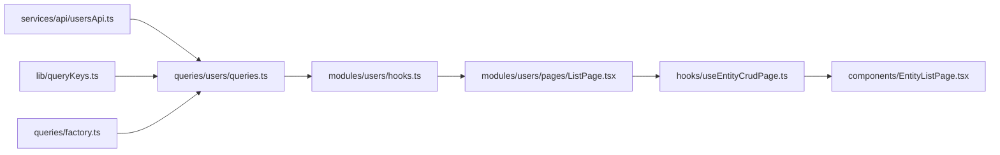

# 1. Project Structure

### Before layouts, decide your folders.

Example:

    src/
    ├── app/              # App shell, providers
    ├── assets/
    ├── components/       # Shared app components (EntityListPage, dialogs, etc.)
    │   └── ui/           # Some shadcn-style pieces (e.g. form.tsx)
    ├── constants/
    ├── hooks/
    ├── layouts/          # AuthLayout, DashboardLayout
    ├── lib/              # queryClient, queryKeys
    ├── modules/          # Feature domains (NOT "features/" or top-level "pages/")
    │   ├── auth/pages/
    │   ├── employees/pages/
    │   ├── employees/hooks.ts
    │   └── ...
    ├── queries/          # TanStack Query hooks
    ├── routes/
    ├── services/         # HTTP client + api/* (not top-level "api/")
    │   └── api/
    ├── slices/           # Redux (auth)
    ├── store/
    ├── test/
    ├── types/
    ├── ui/               # Design system (Button, Modal, Dropdown, etc.)
    └── utils/

## Decide:
This prevents refactoring later.

    • Module-based architecture
    • Redux boundaries
    • Query boundaries
    • Layout boundaries
    • API conventions
    • Folder naming conventions
------------------------------------------------------

# 2. LAYOUTS AND COMPONENTS LAYOUT

### Build the application's skeleton.

## LAYOUTS
Create the skeleton:

    layouts/
    ├── AuthLayout.tsx
    ├── DashboardLayout.tsx
    ├── PublicLayout.tsx
Example:

        AuthLayout.tsx
        ├── Header
        ├── Outlet / Content
        └── Footer
    
        DashboardLayout.tsx
        ├── AppSidebar
        ├── AppHeader
        ├── Outlet / Content
        └── AppFooter
    
        PublicLayout.tsx
        ├── Sidebar
        ├── Header
        ├── Content
        └── Footer

## COMPONENTS LAYOUT
Create the skeleton:
    
    components/layout
    ├── AppBreadcrumbs.tsx
    ├── AppFooter.tsx
    ├── AppHeader.tsx
    ├── AppSidebar.tsx
    ├── GlobalSearch.tsx
    ├── MessageInbox.tsx
    ├── NotificationBell.tsx
    ├── PageShell.tsx
    ├── PublicNavbar.tsx

-----------------------------------------------------------------------------------


# 3. Routing FE

Install:
```sh
    npm install react-router-dom
```

Create the skeleton:

    /routes
    ├── index.tsx
    ├── lazyRoutes.ts
    ├── protectedRoutes.tsx

    /constants
    ├── routes.ts

    /modules
    ├── public
    │   ├── pages/LandingPage
    ├── auth
    │   ├── pages/LoginPage
    ├── dashboard
    │   ├── pages/DashboardPage

    /components
    │   ├── ui/skeleton.tsx
    ├── PageLoader.tsx

### /components/ui/skeleton
creates skeleton ui for the Lazy.AnyPage and used in the loader
```tsx
    import { cn } from '@/lib/utils'
    export default function Skeleton({className, ...props}: React.ComponentProps<"div">){
        return(
            <div
                data-slot="skeleton"
                className={cn("animate-pulse rounded-md bg-muted", className)}
                {...props}
            />
        )
    }
```    
### /components/PageLoader.tsx
```tsx
    import Skeleton from "@/components/ui/skeleton"
    export function PageLoader(): React.JSX.Element {
        return (
            <div className="flex min-h-[200px] flex-col gap-3 p-4">
                <Skeleton className="h-8 w-1/3" />
                <div className="mt-4 space-y-3">
                    <Skeleton className="h-10 w-full" />
                </div>
            </div>
        )
    }
```

### /constants/routes.ts:
```ts
    export const ROUTES = {
       landing: '/',
       login: '/auth/login',
       dashboard: '/dashboard' 
    } as const
```

## Layouts for route - /src/layouts
### AuthLayout
```tsx
    import { Outlet } from 'react-router-dom'
    export default function AuthLayout(): React.JSX.Element {
        return (
            <div className="flex min-h-screen flex-col bg-muted">
                <header className="border-b border-border bg-card px-6 py-4">
                    Header
                </header>
                <div className="flex flex-1 items-center justify-center p-4">
                    <div className="w-full max-w-md rounded-lg border border-border bg-card p-8 shadow-sm">
                    <Outlet />
                    </div>
                </div>
            </div>
        )
}
```
### PublicLayout
```tsx
    import { Outlet } from 'react-router-dom'
    export default function PublicLayout(): React.JSX.Element {
        return (<Outlet />)
    }
```
### DashboardPage
```tsx 
    export function DashboardPage(): React.JSX.Element {
        return(<h1>DASHBOARD - this should be protected by ahout</h1>)
    }
```

## ROUTES
### /routes/lazyRoutes.ts
```ts
    import { lazy } from 'react'
    export const LandingPage = lazy(() =>
        import('@/modules/public/pages/LandingPage').then((m) => ({ default: m.LandingPage })),
    )
    export const LoginPage = lazy(() =>
        import('@/modules/auth/pages/LoginPage').then((m) => ({default: m.LoginPage}))
    )
    export const Dashboard = lazy (() =>
        import('@/modules/dashboard/pages/DashboardPage').then((m) => ({default: m.DashboardPage}))
    )
```
### /routes/protectedRoutes.ts
```tsx
    export default function ProtectedRoute(): React.JSX.Element {
        return(<></>)
    }
```    

### /routes/index.tsx
Includes: Suspense wrap, lazy loading and Page Loader
```tsx
    import AuthLayout from "@/layouts/AuthLayout";
    import DashboardLayout from "@/layouts/DashboardLayout";
    import PublicLayout from "@/layouts/PublicLayout";
    import { Suspense, type ReactNode } from "react";
    import { createBrowserRouter, Navigate } from 'react-router-dom'
    interface SuspenseWrapProps {
        children: ReactNode
    }
    function SuspenseWrapProp({children}: SuspenseWrapProps): React.JSX.Element
    {
        return<Suspense fallback="">{children}</Suspense>
    }
    export const router = createBrowserRouter([
        {
            element: <PublicLayout />,
            children: [
                //e.g:
                //{ index: true, element: <SuspenseWrap><Lazy.LandingPage /></SuspenseWrap> },
                //{ path: 'about', element: <SuspenseWrap><Lazy.AboutPage /></SuspenseWrap> },
                {},
                {}
            ]
        },
        {
            path: '/auth',
            element: <AuthLayout />,
            children: [
                {},
                {}
            ]
        },
        {
            path: '/dashboard',
            element: <DashboardLayout />,
            children: [
                {},
                {}
            ]
        }
    ])
```

### src/App.tsx updates
```tsx
    import { RouterProvider } from 'react-router-dom'
    import { router } from '@/routes/index'
    export default function App(): React.JSX.Element {
        return (<RouterProvider router={router} />)
    }
```

Example:

# 4. Authentication Foundation

| Concern | File |
|---------|------|
| Session state | [`src/slices/authSlice.ts`](src/slices/authSlice.ts) |
| Auth API | [`src/services/api/authApi.ts`](src/services/api/authApi.ts) |
| Token storage + interceptors | [`src/services/httpClient.ts`](src/services/httpClient.ts) |
| Handler wiring | [`src/app/App.tsx`](src/app/App.tsx) |
| Route guard | [`src/routes/protectedRoute.tsx`](src/routes/protectedRoute.tsx) |
| Permission checks | [`src/hooks/usePermission.ts`](src/hooks/usePermission.ts) |

## Token storage

`sessionStorage` keys (via `httpClient.ts`):

| Key | Purpose |
|-----|---------|
| `hris_access_token` | JWT access token |
| `hris_refresh_token` | Refresh token |
| `hris_tenant_id` | Multi-tenant header value |

In-memory mirrors exist for `accessToken` and `tenantId` for fast interceptor access.

## Flows

**Login:** `LoginPage` → Redux `login` thunk → `authApi.login` → store tokens + tenant → `isAuthenticated = true` → navigate to dashboard.

**Logout:** `AppHeader` → Redux `logout` thunk → `authApi.logout` → `clearAuthStorage`.

**Bootstrap:** On app mount, `App.tsx` calls `setAuthHandlers` and, if a token exists, dispatches `fetchMe`.

**401 refresh:** Axios response interceptor queues failed requests, calls `refreshSession` thunk once, retries with new token. On refresh failure, clears auth storage.

**Request headers:** Every request gets `Authorization: Bearer <token>` and `X-Tenant-Id: <tenantId>` when available.

## Wiring auth handlers

```tsx
// src/app/App.tsx
useEffect(() => {
  setAuthHandlers({
    refresh: async () => {
      const result = await dispatch(refreshSession())
      if (refreshSession.fulfilled.match(result)) return result.payload
      return null
    },
    unauthorized: () => {
      void dispatch(refreshSession())
    },
  })
  if (getAccessToken()) void dispatch(fetchMe())
}, [dispatch])
```

## Route-level permissions

`ProtectedRoute` accepts an optional `permissions` prop, but **no routes pass it today**. To enforce permissions on a route:

```tsx
{
  element: <ProtectedRoute permissions={[PERMISSIONS.usersRead]} />,
  children: [/* users routes */],
}
```

Sidebar nav already filters by permission via `constants/navigation.ts`; route-level enforcement is an additional layer you can wire when needed.

---

# 5. Reusable UI Components

Two layers — do not confuse them:

### `components/ui/` — shadcn/Radix primitives

27 files configured via [`components.json`](components.json) (`radix-nova` style):

`alert`, `alert-dialog`, `avatar`, `badge`, `breadcrumb`, `button`, `card`, `checkbox`, `collapsible`, `command`, `dialog`, `dropdown-menu`, `form`, `input`, `input-group`, `label`, `popover`, `scroll-area`, `select`, `separator`, `sheet`, `skeleton`, `table`, `tabs`, `textarea`, `tooltip`

Add new shadcn components with the shadcn CLI (aliases point to `@/components/ui`).

### `ui/` — convenience barrel

[`src/ui/index.ts`](src/ui/index.ts) re-exports common primitives plus thin wrappers: `Modal`, `Select`, `Dropdown`, `Tooltip`, `Tabs`.

### Shared app components

| Component | Purpose |
|-----------|---------|
| `EntityListPage` | Generic searchable table with active/trashed tabs |
| `EntityFormDialog` | Create/edit dialog (name + status) |
| `ConfirmDialog` | Soft delete, hard delete, restore confirmations |
| `PageHeader` | Page title + description |
| `PageLoader` | Suspense fallback |
| `EmptyState` | Empty list placeholder |
| `ErrorBoundary` | Catches render errors |
| `StatusBadge` | Status pill display |
| `MetricsDashboard` | Dashboard metrics cards |
| `OrgChartTree` | Organization chart visualization |
| `EmployeeActionDialog` | Promote/transfer employee flows |

**Principle:** Radix UI = behavior engine; Tailwind classes = styling; this project's components and conventions = final authority.

---

# 6. Vitest + React Testing Library

> **Important:** This repo uses **Vitest**, not Jest. The API is Jest-compatible (`describe`, `it`, `expect`), but config and scripts say Vitest.

### What this covers

- Unit testing (slices, hooks, utilities)
- Component testing (layout, design system)
- Redux logic testing (`uiSlice`, auth schemas)
- Integration testing against a live API (separate config)

### Setup structure

```
src/test/
├── setup.ts              # @testing-library/jest-dom, matchMedia mock
├── utils.tsx             # renderWithProviders
├── fixtures.ts           # mockAdminUser
├── features.ts           # integration coverage manifest
├── unit/
│   ├── components/layout/
│   └── slices/
└── integration/          # live API tests (vitest.integration.config.ts)
```

Co-located tests also exist: `src/**/*.test.{ts,tsx}` (e.g. `LoginPage.test.tsx`, `factory.test.ts`).

### Config

[`vitest.config.ts`](vitest.config.ts):

- Environment: `jsdom`
- Globals: `true`
- Setup: `src/test/setup.ts`
- Include: `src/**/*.test.{ts,tsx}`
- Exclude: `src/test/integration/**`
- Alias: `@` → `./src`

### `renderWithProviders`

[`src/test/utils.tsx`](src/test/utils.tsx) wraps components with Redux store, QueryClient, MemoryRouter, ThemeProvider, and TooltipProvider. Use this instead of bare `render()`.

### Scripts

| Command | Purpose |
|---------|---------|
| `npm run test` | Unit tests |
| `npm run test:watch` | Watch mode |
| `npm run test:coverage` | Coverage report |
| `npm run test:integration` | Live API tests (starts BE + Postgres) |
| `npm run test:all` | Unit + integration + E2E |

### What to test first

- `uiSlice` reducer actions
- Layout components (`PublicNavbar`, `PageShell`)
- Auth schemas and `LoginPage`
- `queries/factory.ts` mutation invalidation
- `services/errors.ts` normalization
- shadcn primitives via `ui/Button.test.tsx`

**Core idea:** Tests validate logic and UI behavior in isolation via `renderWithProviders` — not full app flows (those belong in integration/E2E tests).

---

# 7. Global UI State

Redux slices for **UI only** — no feature data in Redux.

[`src/slices/uiSlice.ts`](src/slices/uiSlice.ts):

| State | Actions |
|-------|---------|
| `sidebarOpen` | `toggleSidebar`, `setSidebarOpen` |
| `theme` | `setTheme` (`light` \| `dark` \| `system`) |
| `globalLoading` | `setGlobalLoading` |
| `expandedNavGroups` | `toggleNavGroup`, `setExpandedNavGroups` |
| `notificationsOpen` | `setNotificationsOpen` |
| `commandPaletteOpen` | `setCommandPaletteOpen` |
| `sidebarSearchQuery` | `setSidebarSearchQuery` |

Theme is applied via [`src/hooks/useTheme.ts`](src/hooks/useTheme.ts) and [`src/components/ThemeProvider.tsx`](src/components/ThemeProvider.tsx).

**Store composition** ([`src/store/rootReducer.ts`](src/store/rootReducer.ts)):

```ts
export const rootReducer = combineReducers({
  auth: authReducer,
  ui: uiReducer,
})
```

Server/business state lives in TanStack Query — do not add feature slices to Redux.

---

# 8. API Layer

### HTTP client

[`src/services/httpClient.ts`](src/services/httpClient.ts):

- Base URL: `${VITE_API_BASE_URL}/api/v1` (version from [`src/constants/api.ts`](src/constants/api.ts))
- Request interceptor: Bearer token + `X-Tenant-Id`
- Response interceptor: 401 queue-based token refresh

### API helpers

[`src/services/api/client.ts`](src/services/api/client.ts):

| Helper | Purpose |
|--------|---------|
| `apiGet`, `apiPost`, `apiPut`, `apiPatch`, `apiDelete` | Unwrap `ApiResponse<T>.data` |
| `createResourceApi` | Read-only list + getById |
| `createMutableResourceApi` | Full CRUD + soft delete, restore, trashed list, deactivate |

### Per-domain APIs

```
services/api/
├── client.ts
├── authApi.ts          # Custom auth endpoints
├── usersApi.ts         # createMutableResourceApi
├── employeesApi.ts     # + promote/transfer
├── leaveApi.ts         # + approve/reject/pending
├── permissionsApi.ts   # Read-only catalog
├── analyticsApi.ts     # Dashboard metrics
└── … (29 modules total)
```

Paths are centralized in [`src/constants/endpoints.ts`](src/constants/endpoints.ts).

### Example: users API

```ts
// src/services/api/usersApi.ts
import { endpoints } from '@/constants/endpoints'
import { createMutableResourceApi } from './client'
import type { UsersEntity } from '@/modules/users/types'

export const usersApi = createMutableResourceApi<UsersEntity>({
  list: endpoints.users.list,
  byId: endpoints.users.byId,
  trashed: endpoints.users.trashed,
  softDelete: endpoints.users.softDelete,
  restore: endpoints.users.restore,
  deactivate: endpoints.users.deactivate,
  reactivate: endpoints.users.reactivate,
})
```

### Error normalization

[`src/services/errors.ts`](src/services/errors.ts) — `normalizeApiError()` used by auth slice and query client global error handler.

---

# 9. TanStack Query Setup

### Create conventions

| File | Role |
|------|------|
| [`src/lib/queryClient.ts`](src/lib/queryClient.ts) | Singleton client; global toast on errors |
| [`src/lib/queryKeys.ts`](src/lib/queryKeys.ts) | Hierarchical keys per resource |
| [`src/queries/factory.ts`](src/queries/factory.ts) | `createResourceQueryHooks()` factory |
| [`src/queries/<domain>/queries.ts`](src/queries/users/queries.ts) | Wires factory to API + keys |
| [`src/queries/index.ts`](src/queries/index.ts) | Barrel re-exports all hooks |

### Query client defaults

```ts
// src/lib/queryClient.ts
export const queryClient = new QueryClient({
  defaultOptions: {
    queries: { staleTime: 60_000, gcTime: 5 * 60_000, retry: 1, refetchOnWindowFocus: false },
    mutations: { retry: 0 },
  },
  queryCache: new QueryCache({ onError: handleError }),
  mutationCache: new MutationCache({ onError: handleError }),
})
```

### Query keys pattern

```ts
// src/lib/queryKeys.ts
export const queryKeys = {
  users: {
    all: ['users'] as const,
    list: () => [...queryKeys.users.all, 'list'] as const,
    trashed: () => [...queryKeys.users.all, 'trashed'] as const,
  },
  // … one entry per resource
}
```

### Factory hooks

`createResourceQueryHooks(queryKeys.users, usersApi)` returns:

- `useList`, `useTrashedList`
- `useCreate`, `useUpdate`
- `useSoftDelete`, `useRestore`, `useRemove`

Mutations invalidate the resource's `all` key and show Sonner toasts on success.

### Wiring example

```ts
// src/queries/users/queries.ts
import { queryKeys } from '@/lib/queryKeys'
import { usersApi } from '@/services/api/usersApi'
import { createResourceQueryHooks } from '../factory'

const hooks = createResourceQueryHooks(queryKeys.users, usersApi)

export const useUsersList = hooks.useList
export const useUsersTrashedList = hooks.useTrashedList
export const useCreateUser = hooks.useCreate
export const useUpdateUser = hooks.useUpdate
export const useSoftDeleteUser = hooks.useSoftDelete
export const useRestoreUser = hooks.useRestore
export const useRemoveUser = hooks.useRemove
```

```ts
// src/modules/users/hooks.ts
export {
  useUsersList,
  useUsersTrashedList,
  useCreateUser,
  useUpdateUser,
  useSoftDeleteUser,
  useRestoreUser,
  useRemoveUser,
} from '@/queries'
```

### Data flow



---

# 10. Feature Module Structure

### Standard module (most HR domains)

```
modules/<domain>/
├── pages/ListPage.tsx    # Named export: <Domain>ListPage
├── hooks.ts              # Re-exports from @/queries
└── types.ts              # Domain entity types
```

### Generic CRUD page pattern

Most list pages follow this pattern ([`modules/users/pages/ListPage.tsx`](src/modules/users/pages/ListPage.tsx)):

```tsx
import { EntityListPage } from '@/components/EntityListPage'
import { EntityFormDialog } from '@/components/EntityFormDialog'
import { ConfirmDialog } from '@/components/ConfirmDialog'
import { useEntityCrudPage } from '@/hooks/useEntityCrudPage'
import { useUsersList, useUsersTrashedList, useCreateUser, /* … */ } from '../hooks'

export function UsersListPage(): React.JSX.Element {
  const crud = useEntityCrudPage({
    title: 'Users',
    description: 'Manage users records',
    emptyTitle: 'No users found',
    entitySingular: 'user',
    hooks: {
      useList: useUsersList,
      useTrashedList: useUsersTrashedList,
      useCreate: useCreateUser,
      useUpdate: useUpdateUser,
      useSoftDelete: useSoftDeleteUser,
      useRestore: useRestoreUser,
      useRemove: useRemoveUser,
    },
  })

  return (
    <>
      <EntityListPage {...crud.listPageProps} />
      <EntityFormDialog {...crud.formDialogProps} />
      <ConfirmDialog {...crud.confirmDialogProps} />
    </>
  )
}
```

`useEntityCrudPage` orchestrates list state, form dialog open/close, and confirm dialog actions. `EntityFormDialog` only supports `name` + `status` fields.

## Checklist: Add a new HR module

Use this when scaffolding a new domain (e.g. `expenses`):

1. **Types** — Create `src/modules/expenses/types.ts` with entity interface (`id`, `name`, `status`, …)
2. **Endpoints** — Add paths to [`src/constants/endpoints.ts`](src/constants/endpoints.ts)
3. **API** — Create `src/services/api/expensesApi.ts` using `createMutableResourceApi` (or `createResourceApi` for read-only)
4. **Query keys** — Add `expenses` entry to [`src/lib/queryKeys.ts`](src/lib/queryKeys.ts)
5. **Query hooks** — Create `src/queries/expenses/queries.ts` via `createResourceQueryHooks`
6. **Barrel** — Re-export hooks from [`src/queries/index.ts`](src/queries/index.ts)
7. **Module** — Create `src/modules/expenses/`:
   - `hooks.ts` — re-export query hooks
   - `pages/ListPage.tsx` — `ExpensesListPage` using `useEntityCrudPage`
   - `types.ts` — entity types
8. **Routing** — Follow the [Add a new route](#checklist-add-a-new-route) checklist above
9. **Testing** — Add entry to [`src/test/features.ts`](src/test/features.ts) and [`cypress/e2e/features.cy.ts`](cypress/e2e/features.cy.ts) if coverage is required
10. **ESLint** — Do not import from other `modules/*`; only use shared layers (`@/components`, `@/hooks`, `@/queries`, etc.)

### Modules with custom UI (not generic CRUD)

| Module | Difference |
|--------|------------|
| `auth` | Login/register/forgot with RHF + zod; no list page |
| `public` | Marketing pages (Landing, About, Pricing, Contact) |
| `dashboard` | Metrics via analytics query |
| `leave` | Pending tab + approve/reject actions |
| `employees` | Promote/transfer via `EmployeeActionDialog` |
| `organization` | Org chart tree visualization |
| `reports` | Report generation cards |
| `permissions` | Read-only permission catalog |
| `audit`, `system` | Read-only lists |

When a module needs custom UI, keep API + query hooks in the shared layers and build custom components in the module's `pages/` folder.

---

# 11. E2E Testing (Cypress)

Start after real user flows exist in the application.

### What this covers

- Full login flow
- Protected route navigation
- Feature page smoke tests
- Sidebar navigation

### Structure

```
cypress/
├── e2e/
│   ├── auth.cy.ts
│   ├── navigation.cy.ts
│   └── features.cy.ts
├── fixtures/
│   ├── auth.json
│   └── dashboard.json
└── support/
    ├── commands.ts
    └── e2e.ts
```

### Config

[`cypress.config.ts`](cypress.config.ts) — base URL `http://localhost:5173`, specs in `cypress/e2e/**/*.cy.ts`.

### Scripts

| Command | Purpose |
|---------|---------|
| `npm run cy:open` | Interactive Cypress runner |
| `npm run cy:run` | Headless (dev server must be running) |
| `npm run test:e2e` | Starts BE + FE, then runs Cypress |

**Core idea:** Cypress tests behave like real users — click, type, navigate — not test implementation details.

Integration tests (`npm run test:integration`) require a live NestJS API. E2E can run with mocked API responses depending on test setup.

---

# 12. Forms + Validation

### Auth forms — RHF + zod (fully implemented)

Schemas in [`src/modules/auth/schemas.ts`](src/modules/auth/schemas.ts):

```ts
import { z } from 'zod'

export const loginSchema = z.object({
  email: z.email(),
  password: z.string().min(6),
})

export const registerSchema = z.object({
  firstName: z.string().min(1, 'First name is required'),
  lastName: z.string().min(1, 'Last name is required'),
  email: z.email(),
  password: z.string().min(6, 'Password must be at least 6 characters'),
})

export const forgotPasswordSchema = z.object({
  email: z.email(),
})
```

Usage pattern (LoginPage):

```tsx
const form = useForm<LoginFormData>({
  resolver: zodResolver(loginSchema),
  defaultValues: { email: '', password: '' },
})
```

UI uses shadcn `Form` components from [`src/components/ui/form.tsx`](src/components/ui/form.tsx).

| Page | Validation | Submit path |
|------|------------|-------------|
| LoginPage | zod + RHF | Redux `login` thunk |
| RegisterPage | zod + RHF | Direct `authApi.register` (redirects to login; does not auto-login) |
| ForgotPasswordPage | zod + RHF | Direct `authApi.forgotPassword` |

### Entity CRUD forms — different pattern

[`src/components/EntityFormDialog.tsx`](src/components/EntityFormDialog.tsx) uses `useState`, not RHF/zod. Fields: `name` + `status` only. This is sufficient for the generic scaffold but not for production domain-specific forms.

**When extending:** Add per-module zod schemas and RHF forms when moving beyond generic CRUD (e.g. employee hire form, leave request form).

---

# Recommended Order for Enterprise Project

Follow this order when bootstrapping a new project or onboarding a feature team:

1. Folder structure
2. Layouts
3. Routing
4. Authentication foundation
5. Reusable UI components
6. Vitest + React Testing Library setup
7. Redux UI slice
8. Axios + interceptors
9. TanStack Query setup
10. Feature modules
11. E2E testing (Cypress)
12. Forms and validation (per feature, beyond generic CRUD)

For a React + Redux Toolkit + TanStack Query + shadcn enterprise application, **Layouts → Routing → Authentication** is usually the next step after scaffolding. That gives the application a skeleton before reusable components and business features.

---

# Known Gaps and Honest Expectations

Read this section to avoid surprises:

| Topic | Reality in this codebase |
|-------|--------------------------|
| Test runner | **Vitest**, not Jest (Jest-compatible API only) |
| Feature folder name | **`modules/`**, not `features/` |
| List pages | Most are **API-wired but UI-generic** (name + status fields only) |
| Reset password | `ROUTES.resetPassword` constant exists; **no page or router entry** |
| Route permissions | `ProtectedRoute` supports `permissions` prop; **not wired in router yet** |
| Register flow | Does **not** auto-login; redirects to login page |
| Integration tests | Require **live backend** (Docker Postgres + NestJS) |
| E2E tests | Can run with mocked API; `test:e2e` starts full stack by default |
| Entity forms | `EntityFormDialog` uses local state, not RHF/zod |
| Cross-module imports | **Forbidden** by ESLint boundaries rule |

---

# Quick Reference: Key Files

| Area | Path |
|------|------|
| Entry | `src/main.tsx` |
| App bootstrap | `src/app/App.tsx`, `src/app/providers.tsx` |
| Auth slice | `src/slices/authSlice.ts` |
| UI slice | `src/slices/uiSlice.ts` |
| HTTP + tokens | `src/services/httpClient.ts` |
| API factory | `src/services/api/client.ts` |
| Endpoints | `src/constants/endpoints.ts` |
| Routes | `src/routes/index.tsx`, `lazyRoutes.tsx`, `protectedRoute.tsx` |
| Route paths | `src/constants/routes.ts` |
| Navigation | `src/constants/navigation.ts` |
| Query client | `src/lib/queryClient.ts` |
| Query factory | `src/queries/factory.ts` |
| Query keys | `src/lib/queryKeys.ts` |
| CRUD orchestration | `src/hooks/useEntityCrudPage.ts` |
| Generic list UI | `src/components/EntityListPage.tsx` |
| Auth schemas | `src/modules/auth/schemas.ts` |
| shadcn config | `components.json` |
| Vitest config | `vitest.config.ts` |
| Test utils | `src/test/utils.tsx` |
| Cypress config | `cypress.config.ts` |
