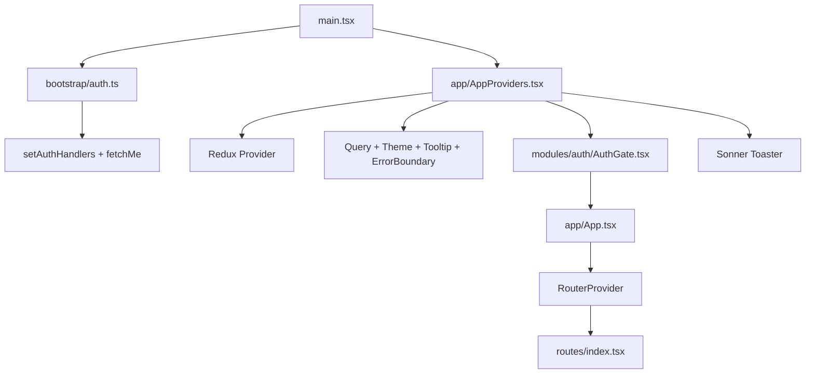
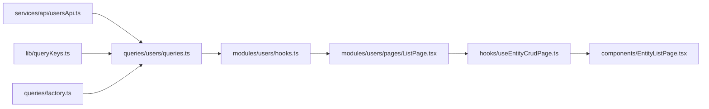

# HRIS Enterprise Frontend — Setup Guide

A step-by-step guide for setting up and extending this codebase. It mirrors the standard enterprise React scaffold order (structure → layouts → routing → auth → shared UI → testing → state → API → queries → features) but is grounded in **this repo's actual files, conventions, and patterns**.

For quick start commands, see [README.md](./README.md).

---

## Prerequisites

**Stack (already configured in this project):**

| Layer | Technology |
|-------|------------|
| UI | React 19, TypeScript, Tailwind CSS 4 |
| Build | Vite 8 |
| Routing | react-router-dom v7 (`createBrowserRouter`) |
| Client state | Redux Toolkit (`auth`, `ui` slices only) |
| Server state | TanStack Query v5 |
| HTTP | Axios |
| Forms (auth) | react-hook-form + zod |
| UI primitives | shadcn/ui + Radix (`radix-nova` style) |
| Toasts | Sonner |
| Monitoring | Sentry (optional) |

**Environment:**

```bash
npm install
cp .env.example .env
```

`.env` variables:

| Variable | Purpose |
|----------|---------|
| `VITE_API_BASE_URL` | Backend origin (default `http://localhost:3000`) |
| `VITE_APP_ENV` | Environment label for Sentry |
| `VITE_SENTRY_DSN` | Optional error reporting |

**Path alias:** `@/*` → `src/*` (configured in `vite.config.ts` and `tsconfig.app.json`).

### Bootstrap flow

The app boots in this order:



| File | Role |
|------|------|
| [`src/main.tsx`](src/main.tsx) | Calls `bootstrapAuth(store)` before render; mounts `<AppProviders>` + `<App />` in StrictMode |
| [`src/bootstrap/auth.ts`](src/bootstrap/auth.ts) | Wires `setAuthHandlers` (401 refresh) and dispatches `fetchMe` when a token exists |
| [`src/app/AppProviders.tsx`](src/app/AppProviders.tsx) | Redux `Provider`, composed providers, `AuthGate`, `Toaster` |
| [`src/app/providers/`](src/app/providers/) | `QueryProvider`, `ThemeProvider`, `TooltipProvider`, `ErrorBoundaryProvider` |
| [`src/modules/auth/AuthGate.tsx`](src/modules/auth/AuthGate.tsx) | Full-page loader while session restores (`fetchMe` in flight) |
| [`src/app/App.tsx`](src/app/App.tsx) | `<RouterProvider router={router} />` only |

---

# 1. Project Structure

### Before layouts, decide your folders.

This repo uses a **module-based** layout. The actual `src/` tree:

```
src/
├── app/              # App shell
│   ├── App.tsx       # RouterProvider only
│   ├── AppProviders.tsx
│   ├── instrumentation.ts  # Sentry init
│   └── providers/    # QueryProvider, ThemeProvider, etc.
├── assets/           # Static SVGs
├── bootstrap/        # Pre-render setup (auth handlers + session restore)
│   └── auth.ts
├── components/       # Shared app components
│   ├── layout/       # AppHeader, AppSidebar, PublicNavbar, etc.
│   └── ui/           # shadcn/Radix primitives (button, form, table, …)
├── constants/        # routes, endpoints, navigation, permissions, routeMeta
├── hooks/            # Typed Redux hooks, useEntityCrudPage, usePermission, useTheme
├── layouts/          # PublicLayout, AuthLayout, DashboardLayout
├── lib/              # queryClient, queryKeys, cn()
├── modules/          # Feature domains (30+ modules) — NOT features/ or top-level pages/
│   └── auth/         # AuthGate, pages/ (Login, Register, Forgot), schemas.ts
├── queries/          # TanStack Query hooks (factory + per-domain)
├── routes/           # index.tsx, lazyRoutes.tsx, protectedRoute.tsx
├── services/         # httpClient, errors, logger
│   └── api/          # Typed API modules — NOT top-level api/
├── slices/           # Redux: authSlice, uiSlice
├── store/            # configureStore + rootReducer
├── test/             # Vitest setup, utils, fixtures, unit/, integration/
├── types/            # Shared TypeScript types
├── ui/               # Design-system barrel (re-exports shadcn + thin wrappers)
└── utils/            # cn, normalize, thunkError helpers
```

## Decide upfront

These choices are already made in this codebase. Follow them when adding features to avoid refactoring later.

- **Auth split** — `modules/auth/` holds auth **UI** (pages, schemas, `AuthGate`); `slices/authSlice.ts` holds **session state** (user, tokens, `isAuthenticated`)
- **Module-based architecture** under `modules/` — enforced by `eslint-plugin-boundaries` (modules must not import from other modules)
- **Redux boundaries** — session (`auth`) and UI (`ui`) only; no feature slices
- **Query boundaries** — TanStack Query hooks live in `queries/`, re-exported by `modules/<domain>/hooks.ts`
- **Layout boundaries** — three route layouts in `layouts/`; shell pieces in `components/layout/`
- **API conventions** — `services/api/<domain>Api.ts` + paths in `constants/endpoints.ts`
- **Folder naming** — `modules/` not `features/`; `protectedRoute.tsx` (singular) not `protectedRoutes.tsx`
- **Page exports** — named exports (`export function UsersListPage`) required for the lazy-loading pattern
- **Testing** — Vitest (not Jest), with Jest-compatible `describe`/`it`/`expect` API

---

# 2. Layouts and Components Layout

### Build the application's skeleton.

## LAYOUTS

Located in [`src/layouts/`](src/layouts/):

| Layout | Routes | Structure |
|--------|--------|-----------|
| `PublicLayout` | `/`, `/about`, `/pricing`, `/contact` | `PublicNavbar` → `<Outlet>` |
| `AuthLayout` | `/auth/login`, `/auth/register`, `/auth/forgot-password` | Header → centered card → footer |
| `DashboardLayout` | All protected app routes | `AppSidebar` → `AppHeader` → `<Outlet>` → `AppFooter` |

**Behavior:** `PublicLayout` and `AuthLayout` redirect authenticated users to `ROUTES.home` (`/dashboard`).

### AuthLayout (example)

```tsx
// src/layouts/AuthLayout.tsx
import { Link, Outlet, Navigate } from 'react-router-dom'
import { useAppSelector } from '@/hooks'
import { selectIsAuthenticated } from '@/slices/authSlice'
import { ROUTES } from '@/constants/routes'

export function AuthLayout(): React.JSX.Element {
  const isAuthenticated = useAppSelector(selectIsAuthenticated)
  if (isAuthenticated) return <Navigate to={ROUTES.home} replace />
  return (
    <div className="flex min-h-screen flex-col bg-muted">
      <header className="border-b border-border bg-card px-6 py-4">
        <div className="mx-auto flex max-w-md items-center gap-2">
          <Link to={ROUTES.landing} className="flex items-center gap-2">
            <div className="flex h-8 w-8 items-center justify-center rounded-lg bg-primary text-sm font-bold text-primary-foreground">
              H
            </div>
            <span className="font-semibold">HRIS Enterprise</span>
          </Link>
        </div>
      </header>
      <div className="flex flex-1 items-center justify-center p-4">
        <div className="w-full max-w-md rounded-lg border border-border bg-card p-8 shadow-sm">
          <Outlet />
        </div>
      </div>
      <footer className="border-t border-border px-6 py-3 text-center text-xs text-muted-foreground">
        &copy; {new Date().getFullYear()} HRIS Enterprise
      </footer>
    </div>
  )
}
```

### DashboardLayout (example)

```tsx
// src/layouts/DashboardLayout.tsx — simplified
<div className="flex min-h-screen">
  <aside>{/* AppSidebar — collapsible via ui.sidebarOpen */}</aside>
  <div className="flex min-w-0 flex-1 flex-col">
    <AppHeader />
    <main className="flex flex-1 flex-col overflow-auto p-6">
      <Outlet />
    </main>
    <AppFooter />
  </div>
</div>
```

## COMPONENTS LAYOUT

Shell components live in [`src/components/layout/`](src/components/layout/):

```
components/layout/
├── AppBreadcrumbs.tsx
├── AppFooter.tsx
├── AppHeader.tsx
├── AppSidebar.tsx
├── DataTableToolbar.tsx
├── GlobalSearch.tsx
├── MessageInbox.tsx
├── NotificationBell.tsx
├── PageShell.tsx
└── PublicNavbar.tsx
```

**Import convention:** Use `@/components/ui/*` for shadcn primitives, or `@/ui` for the convenience barrel (`Button`, `Modal`, `Select`, etc.).

---

# 3. Routing FE

`react-router-dom` v7 is already installed. Do not add a separate install step.

## File skeleton

```
routes/
├── index.tsx           # createBrowserRouter
├── lazyRoutes.tsx      # React.lazy() per page
└── protectedRoute.tsx  # Auth guard (singular filename)
constants/
└── routes.ts           # ROUTES path constants
components/
├── PageLoader.tsx
└── ui/skeleton.tsx
```

### `/components/ui/skeleton.tsx`

Skeleton UI used by `PageLoader` and lazy route fallbacks:

```tsx
import { cn } from '@/lib/utils'

function Skeleton({ className, ...props }: React.ComponentProps<'div'>) {
  return (
    <div
      data-slot="skeleton"
      className={cn('animate-pulse rounded-md bg-muted', className)}
      {...props}
    />
  )
}

export { Skeleton }
```

### `/components/PageLoader.tsx`

```tsx
import { Skeleton } from '@/components/ui/skeleton'

export function PageLoader(): React.JSX.Element {
  return (
    <div className="flex min-h-[200px] flex-col gap-3 p-4">
      <Skeleton className="h-8 w-1/3" />
      <Skeleton className="h-4 w-1/2" />
      <div className="mt-4 space-y-3">
        <Skeleton className="h-10 w-full" />
        <Skeleton className="h-10 w-full" />
        <Skeleton className="h-10 w-full" />
      </div>
    </div>
  )
}
```

### `/routes/lazyRoutes.tsx`

Pages use **named exports**. Lazy imports map them to `default`:

```tsx
import { lazy } from 'react'

export const LandingPage = lazy(() =>
  import('@/modules/public/pages/LandingPage').then((m) => ({ default: m.LandingPage })),
)
export const LoginPage = lazy(() =>
  import('@/modules/auth/pages/LoginPage').then((m) => ({ default: m.LoginPage })),
)
export const UsersListPage = lazy(() =>
  import('@/modules/users/pages/ListPage').then((m) => ({ default: m.UsersListPage })),
)
// … one lazy export per page
```

### `/constants/routes.ts`

Always use `ROUTES` — never hardcode path strings in components:

```ts
export const ROUTES = {
  landing: '/',
  about: '/about',
  pricing: '/pricing',
  contact: '/contact',
  home: '/dashboard',
  login: '/auth/login',
  register: '/auth/register',
  forgotPassword: '/auth/forgot-password',
  resetPassword: '/auth/reset-password',
  users: '/users',
  employees: '/employees',
  // … all dashboard paths
} as const
```

### `/routes/index.tsx`

Three layout groups with `Suspense` + `PageLoader`:

```tsx
import { Suspense, type ReactNode } from 'react'
import { createBrowserRouter, Navigate } from 'react-router-dom'
import { AuthLayout } from '@/layouts/AuthLayout'
import { DashboardLayout } from '@/layouts/DashboardLayout'
import { PublicLayout } from '@/layouts/PublicLayout'
import { ProtectedRoute } from '@/routes/protectedRoute'
import { PageLoader } from '@/components/PageLoader'
import { ROUTES } from '@/constants/routes'
import * as Lazy from './lazyRoutes'

function SuspenseWrap({ children }: { children: ReactNode }): React.JSX.Element {
  return <Suspense fallback={<PageLoader />}>{children}</Suspense>
}

export const router = createBrowserRouter([
  {
    element: <PublicLayout />,
    children: [
      { index: true, element: <SuspenseWrap><Lazy.LandingPage /></SuspenseWrap> },
      { path: 'about', element: <SuspenseWrap><Lazy.AboutPage /></SuspenseWrap> },
      // …
    ],
  },
  {
    path: '/auth',
    element: <AuthLayout />,
    children: [
      { path: 'login', element: <SuspenseWrap><Lazy.LoginPage /></SuspenseWrap> },
      { path: 'register', element: <SuspenseWrap><Lazy.RegisterPage /></SuspenseWrap> },
      { path: 'forgot-password', element: <SuspenseWrap><Lazy.ForgotPasswordPage /></SuspenseWrap> },
    ],
  },
  {
    element: <ProtectedRoute />,
    children: [
      {
        element: <DashboardLayout />,
        children: [
          { path: 'dashboard', element: <SuspenseWrap><Lazy.DashboardPage /></SuspenseWrap> },
          { path: 'users', element: <SuspenseWrap><Lazy.UsersListPage /></SuspenseWrap> },
          // … all protected routes
        ],
      },
    ],
  },
  { path: '/login', element: <Navigate to={ROUTES.login} replace /> },
  { path: '*', element: <Navigate to={ROUTES.landing} replace /> },
])
```

### `/routes/protectedRoute.tsx`

```tsx
export function ProtectedRoute({ permissions }: ProtectedRouteProps): React.JSX.Element {
  const isAuthenticated = useAppSelector(selectIsAuthenticated)
  const { can } = usePermission()

  if (!isAuthenticated) return <Navigate to={ROUTES.login} replace />
  if (permissions?.length && !permissions.some((p) => can(p))) {
    return <Navigate to={ROUTES.home} replace />
  }
  return <Outlet />
}
```

## Checklist: Add a new route

1. Add path to [`src/constants/routes.ts`](src/constants/routes.ts) as `ROUTES.<name>`
2. Create page in `src/modules/<domain>/pages/` with a **named export**
3. Add lazy export in [`src/routes/lazyRoutes.tsx`](src/routes/lazyRoutes.tsx)
4. Register route in [`src/routes/index.tsx`](src/routes/index.tsx) under the correct layout:
   - Public → `PublicLayout` children
   - Auth → `AuthLayout` children (`/auth/...`)
   - App → `ProtectedRoute` → `DashboardLayout` children
5. Add sidebar entry in [`src/constants/navigation.ts`](src/constants/navigation.ts) (dashboard) or [`src/constants/publicNavigation.ts`](src/constants/publicNavigation.ts) (public)
6. Add metadata in [`src/constants/routeMeta.ts`](src/constants/routeMeta.ts) for page title and breadcrumbs
7. (Optional) Add to [`src/test/features.ts`](src/test/features.ts) and [`cypress/e2e/features.cy.ts`](cypress/e2e/features.cy.ts)

> **Gap:** `ROUTES.resetPassword` exists in constants, but there is no `ResetPasswordPage` or router entry yet.

---

# 4. Authentication Foundation

## Auth file map

| Concern | File |
|---------|------|
| Login UI | [`src/modules/auth/pages/LoginPage.tsx`](src/modules/auth/pages/LoginPage.tsx) |
| Register / forgot UI | [`src/modules/auth/pages/RegisterPage.tsx`](src/modules/auth/pages/RegisterPage.tsx), [`ForgotPasswordPage.tsx`](src/modules/auth/pages/ForgotPasswordPage.tsx) |
| Validation schemas | [`src/modules/auth/schemas.ts`](src/modules/auth/schemas.ts) |
| Session restore gate | [`src/modules/auth/AuthGate.tsx`](src/modules/auth/AuthGate.tsx) |
| Session state | [`src/slices/authSlice.ts`](src/slices/authSlice.ts) |
| Auth API | [`src/services/api/authApi.ts`](src/services/api/authApi.ts) |
| Token storage + interceptors | [`src/services/httpClient.ts`](src/services/httpClient.ts) |
| Bootstrap wiring | [`src/bootstrap/auth.ts`](src/bootstrap/auth.ts) (called from `main.tsx`) |
| Auth route layout | [`src/layouts/AuthLayout.tsx`](src/layouts/AuthLayout.tsx) |
| App route guard | [`src/routes/protectedRoute.tsx`](src/routes/protectedRoute.tsx) |
| Permission hook | [`src/hooks/usePermission.ts`](src/hooks/usePermission.ts) |
| Optional UI guard | [`src/components/RequirePermission.tsx`](src/components/RequirePermission.tsx) (exists; not wired in pages yet) |

## Auth routes

URLs from [`src/constants/routes.ts`](src/constants/routes.ts). Pages are lazy-loaded via [`src/routes/lazyRoutes.tsx`](src/routes/lazyRoutes.tsx) and registered in [`src/routes/index.tsx`](src/routes/index.tsx) under `AuthLayout` (see **Section 3**).

| Route | Page | Layout |
|-------|------|--------|
| `/auth/login` (`ROUTES.login`) | `LoginPage` | `AuthLayout` |
| `/auth/register` (`ROUTES.register`) | `RegisterPage` | `AuthLayout` |
| `/auth/forgot-password` (`ROUTES.forgotPassword`) | `ForgotPasswordPage` | `AuthLayout` |
| `/login` | redirect → `/auth/login` | — |
| `/dashboard` (`ROUTES.home`) | post-login destination | `DashboardLayout` |

Lazy-loading pattern for auth pages:

```tsx
// src/routes/lazyRoutes.tsx
export const LoginPage = lazy(() =>
  import('@/modules/auth/pages/LoginPage').then((m) => ({ default: m.LoginPage })),
)

// src/routes/index.tsx
{ path: 'login', element: <SuspenseWrap><Lazy.LoginPage /></SuspenseWrap> },
```

## Token storage

`sessionStorage` keys (via `httpClient.ts`):

| Key | Purpose |
|-----|---------|
| `hris_access_token` | JWT access token |
| `hris_refresh_token` | Refresh token |
| `hris_tenant_id` | Multi-tenant header value |

In-memory mirrors exist for `accessToken` and `tenantId` for fast interceptor access.

## Flows

**Login:**

```
User → /auth/login (AuthLayout)
  → LoginPage dispatches login thunk
  → authApi.login → BE returns user + tokens + permissions
  → authSlice stores user, tokens, tenantId
  → navigate(ROUTES.home) → /dashboard
```

```tsx
// src/modules/auth/pages/LoginPage.tsx
void dispatch(login(data)).then((result) => {
  if (login.fulfilled.match(result)) navigate(ROUTES.home)
})
```

**Logout:** `AppHeader` → Redux `logout` thunk → best-effort `authApi.logout` (sends refresh token) → always `clearAuthStorage` in `finally` → redirect to `ROUTES.login` (`/auth/login`) on `logout.fulfilled`.

**Bootstrap:** `main.tsx` calls `bootstrapAuth(store)` before render. That wires `setAuthHandlers` and, if a token exists, dispatches `fetchMe` to restore `user` (including `permissions`) into Redux.

**AuthGate:** While a token exists but `user === null` (session restoring), shows a full-page `PageLoader` until `fetchMe` completes or fails.

**401 refresh:** Axios response interceptor queues failed requests, calls `refreshSession` thunk once, retries with new token. On refresh failure, clears auth storage.

**Request headers:** Every request gets `Authorization: Bearer <token>` and `X-Tenant-Id: <tenantId>` when available.

## Layout guards

| Layout / guard | Behavior |
|----------------|----------|
| `PublicLayout` | Authenticated → redirect `/dashboard` |
| `AuthLayout` | Authenticated → redirect `/dashboard`; logo links to `/` (`ROUTES.landing`) |
| `ProtectedRoute` | Unauthenticated → redirect `/auth/login` |

## Wiring auth handlers

Auth handlers are wired in [`src/bootstrap/auth.ts`](src/bootstrap/auth.ts), **not** in `App.tsx`:

```ts
// src/bootstrap/auth.ts
import { fetchMe, refreshSession } from '@/slices/authSlice'
import { setAuthHandlers, getAccessToken } from '@/services/httpClient'
import type { AppStore } from '@/store'

export function bootstrapAuth(store: AppStore): void {
  setAuthHandlers({
    refresh: async () => {
      const result = await store.dispatch(refreshSession())
      if (refreshSession.fulfilled.match(result)) return result.payload
      return null
    },
    unauthorized: () => {
      void store.dispatch(refreshSession())
    },
  })
  if (getAccessToken()) void store.dispatch(fetchMe())
}
```

Called from `main.tsx` before `createRoot(...).render(...)`.

## Permissions

- `user.permissions` (string array) comes from the backend on **login** and **`GET /auth/me`** — resolved from the user's roles in the database.
- `GET /permissions` is a separate **admin catalog** endpoint (Permissions list page), not used to determine the current user's access.
- FE checks today: sidebar and global search filter via `usePermission()` + `constants/navigation.ts`.
- BE enforces permissions on API endpoints via `PermissionsGuard`.
- `ProtectedRoute` accepts an optional `permissions` prop, and `RequirePermission` can hide UI — **neither is wired to routes or CRUD actions yet**.

To enforce permissions on a route when needed:

```tsx
{
  element: <ProtectedRoute permissions={[PERMISSIONS.usersRead]} />,
  children: [/* users routes */],
}
```

Sidebar nav already filters by permission via `constants/navigation.ts`; route-level and action-level enforcement are additional layers you can wire when needed.

---

# 5. Reusable UI Components

Two layers — do not confuse them:

### `components/ui/` — shadcn/Radix primitives

27 files configured via [`components.json`](components.json) (`radix-nova` style):

`alert`, `alert-dialog`, `avatar`, `badge`, `breadcrumb`, `button`, `card`, `checkbox`, `collapsible`, `command`, `dialog`, `dropdown-menu`, `form`, `input`, `input-group`, `label`, `popover`, `scroll-area`, `select`, `separator`, `sheet`, `skeleton`, `table`, `tabs`, `textarea`, `tooltip`

Add new shadcn components with the shadcn CLI (aliases point to `@/components/ui`).

### `ui/` — convenience barrel

[`src/ui/index.ts`](src/ui/index.ts) re-exports common primitives plus thin wrappers: `Modal`, `Select`, `Dropdown`, `Tooltip`, `Tabs`.

### Shared app components

| Component | Purpose |
|-----------|---------|
| `EntityListPage` | Generic searchable table with active/trashed tabs |
| `EntityFormDialog` | Create/edit dialog (name + status) |
| `ConfirmDialog` | Soft delete, hard delete, restore confirmations |
| `PageHeader` | Standalone page title + description |
| `PageShell` | Dashboard page wrapper (title, description, toolbar, breadcrumbs) |
| `PageLoader` | Suspense fallback |
| `EmptyState` | Empty list placeholder |
| `ErrorBoundary` | Catches render errors |
| `StatusBadge` | Status pill display |
| `MetricsDashboard` | Dashboard metrics cards |
| `OrgChartTree` | Organization chart visualization |
| `EmployeeActionDialog` | Promote/transfer employee flows |

**Principle:** Radix UI = behavior engine; Tailwind classes = styling; this project's components and conventions = final authority.

---

# 6. Vitest + React Testing Library

> **Important:** This repo uses **Vitest**, not Jest. The API is Jest-compatible (`describe`, `it`, `expect`), but config and scripts say Vitest.

### What this covers

- Unit testing (slices, hooks, utilities)
- Component testing (layout, design system)
- Redux logic testing (`uiSlice`, auth schemas)
- Integration testing against a live API (separate config)

### Setup structure

```
src/test/
├── setup.ts              # @testing-library/jest-dom, matchMedia mock
├── utils.tsx             # renderWithProviders
├── fixtures.ts           # mockAdminUser
├── features.ts           # integration coverage manifest
├── unit/
│   ├── components/layout/
│   └── slices/
└── integration/          # live API tests (vitest.integration.config.ts)
```

Co-located tests also exist: `src/**/*.test.{ts,tsx}` (e.g. `LoginPage.test.tsx`, `factory.test.ts`).

### Config

[`vitest.config.ts`](vitest.config.ts):

- Environment: `jsdom`
- Globals: `true`
- Setup: `src/test/setup.ts`
- Include: `src/**/*.test.{ts,tsx}`
- Exclude: `src/test/integration/**`
- Alias: `@` → `./src`

### `renderWithProviders`

[`src/test/utils.tsx`](src/test/utils.tsx) wraps components with Redux store, QueryClient, MemoryRouter, ThemeProvider, and TooltipProvider. Use this instead of bare `render()`.

### Scripts

| Command | Purpose |
|---------|---------|
| `npm run test` | Unit tests |
| `npm run test:watch` | Watch mode |
| `npm run test:coverage` | Coverage report |
| `npm run test:integration` | Live API tests (starts BE + Postgres) |
| `npm run test:all` | Unit + integration + E2E |

### What to test first

- `uiSlice` reducer actions
- Layout components (`PublicNavbar`, `PageShell`)
- Auth schemas and `LoginPage`
- `queries/factory.ts` mutation invalidation
- `services/errors.ts` normalization
- shadcn primitives via `ui/Button.test.tsx`

**Core idea:** Tests validate logic and UI behavior in isolation via `renderWithProviders` — not full app flows (those belong in integration/E2E tests).

---

# 7. Global UI State

Redux slices for **UI only** — no feature data in Redux.

[`src/slices/uiSlice.ts`](src/slices/uiSlice.ts):

| State | Actions |
|-------|---------|
| `sidebarOpen` | `toggleSidebar`, `setSidebarOpen` |
| `theme` | `setTheme` (`light` \| `dark` \| `system`) |
| `globalLoading` | `setGlobalLoading` |
| `expandedNavGroups` | `toggleNavGroup`, `setExpandedNavGroups` |
| `notificationsOpen` | `setNotificationsOpen` |
| `commandPaletteOpen` | `setCommandPaletteOpen` |
| `sidebarSearchQuery` | `setSidebarSearchQuery` |

Theme is applied via [`src/hooks/useTheme.ts`](src/hooks/useTheme.ts) and [`src/components/ThemeProvider.tsx`](src/components/ThemeProvider.tsx).

**Store composition** ([`src/store/rootReducer.ts`](src/store/rootReducer.ts)):

```ts
export const rootReducer = combineReducers({
  auth: authReducer,
  ui: uiReducer,
})
```

Server/business state lives in TanStack Query — do not add feature slices to Redux.

---

# 8. API Layer

### HTTP client

[`src/services/httpClient.ts`](src/services/httpClient.ts):

- Base URL: `${VITE_API_BASE_URL}/api/v1` (version from [`src/constants/api.ts`](src/constants/api.ts))
- Request interceptor: Bearer token + `X-Tenant-Id`
- Response interceptor: 401 queue-based token refresh

### API helpers

[`src/services/api/client.ts`](src/services/api/client.ts):

| Helper | Purpose |
|--------|---------|
| `apiGet`, `apiPost`, `apiPut`, `apiPatch`, `apiDelete` | Unwrap `ApiResponse<T>.data` |
| `createResourceApi` | Read-only list + getById |
| `createMutableResourceApi` | Full CRUD + soft delete, restore, trashed list, deactivate |

### Per-domain APIs

```
services/api/
├── client.ts
├── authApi.ts          # Custom auth endpoints
├── usersApi.ts         # createMutableResourceApi
├── employeesApi.ts     # + promote/transfer
├── leaveApi.ts         # + approve/reject/pending
├── permissionsApi.ts   # Read-only catalog
├── analyticsApi.ts     # Dashboard metrics
└── … (29 modules total)
```

Paths are centralized in [`src/constants/endpoints.ts`](src/constants/endpoints.ts).

### Example: users API

```ts
// src/services/api/usersApi.ts
import { endpoints } from '@/constants/endpoints'
import { createMutableResourceApi } from './client'
import type { UsersEntity } from '@/modules/users/types'

export const usersApi = createMutableResourceApi<UsersEntity>({
  list: endpoints.users.list,
  byId: endpoints.users.byId,
  trashed: endpoints.users.trashed,
  softDelete: endpoints.users.softDelete,
  restore: endpoints.users.restore,
  deactivate: endpoints.users.deactivate,
  reactivate: endpoints.users.reactivate,
})
```

### Error normalization

[`src/services/errors.ts`](src/services/errors.ts) — `normalizeApiError()` used by auth slice and query client global error handler.

---

# 9. TanStack Query Setup

### Create conventions

| File | Role |
|------|------|
| [`src/lib/queryClient.ts`](src/lib/queryClient.ts) | Singleton client; global toast on errors |
| [`src/lib/queryKeys.ts`](src/lib/queryKeys.ts) | Hierarchical keys per resource |
| [`src/queries/factory.ts`](src/queries/factory.ts) | `createResourceQueryHooks()` factory |
| [`src/queries/<domain>/queries.ts`](src/queries/users/queries.ts) | Wires factory to API + keys |
| [`src/queries/index.ts`](src/queries/index.ts) | Barrel re-exports all hooks |

### Query client defaults

```ts
// src/lib/queryClient.ts
export const queryClient = new QueryClient({
  defaultOptions: {
    queries: { staleTime: 60_000, gcTime: 5 * 60_000, retry: 1, refetchOnWindowFocus: false },
    mutations: { retry: 0 },
  },
  queryCache: new QueryCache({ onError: handleError }),
  mutationCache: new MutationCache({ onError: handleError }),
})
```

### Query keys pattern

```ts
// src/lib/queryKeys.ts
export const queryKeys = {
  users: {
    all: ['users'] as const,
    list: () => [...queryKeys.users.all, 'list'] as const,
    trashed: () => [...queryKeys.users.all, 'trashed'] as const,
  },
  // … one entry per resource
}
```

### Factory hooks

`createResourceQueryHooks(queryKeys.users, usersApi)` returns:

- `useList`, `useTrashedList`
- `useCreate`, `useUpdate`
- `useSoftDelete`, `useRestore`, `useRemove`

Mutations invalidate the resource's `all` key and show Sonner toasts on success.

### Wiring example

```ts
// src/queries/users/queries.ts
import { queryKeys } from '@/lib/queryKeys'
import { usersApi } from '@/services/api/usersApi'
import { createResourceQueryHooks } from '../factory'

const hooks = createResourceQueryHooks(queryKeys.users, usersApi)

export const useUsersList = hooks.useList
export const useUsersTrashedList = hooks.useTrashedList
export const useCreateUser = hooks.useCreate
export const useUpdateUser = hooks.useUpdate
export const useSoftDeleteUser = hooks.useSoftDelete
export const useRestoreUser = hooks.useRestore
export const useRemoveUser = hooks.useRemove
```

```ts
// src/modules/users/hooks.ts
export {
  useUsersList,
  useUsersTrashedList,
  useCreateUser,
  useUpdateUser,
  useSoftDeleteUser,
  useRestoreUser,
  useRemoveUser,
} from '@/queries'
```

### Data flow



---

# 10. Feature Module Structure

### Standard module (most HR domains)

```
modules/<domain>/
├── pages/ListPage.tsx    # Named export: <Domain>ListPage
├── hooks.ts              # Re-exports from @/queries
└── types.ts              # Domain entity types
```

### Auth module (non-CRUD)

Unlike HR domain modules, auth lives under `modules/auth/` with no list page or `hooks.ts` re-exports:

```
modules/auth/
├── AuthGate.tsx              # Session restore loader (wraps app in AppProviders)
├── pages/
│   ├── LoginPage.tsx         # Redux login thunk → /dashboard
│   ├── RegisterPage.tsx      # Direct authApi.register → redirect to login
│   └── ForgotPasswordPage.tsx
└── schemas.ts                # zod schemas for login, register, forgot-password
```

Session state remains in `slices/authSlice.ts`; pages dispatch thunks or call `authApi` directly (register/forgot do not auto-login).

### Generic CRUD page pattern

Most list pages follow this pattern ([`modules/users/pages/ListPage.tsx`](src/modules/users/pages/ListPage.tsx)):

```tsx
import { EntityListPage } from '@/components/EntityListPage'
import { EntityFormDialog } from '@/components/EntityFormDialog'
import { ConfirmDialog } from '@/components/ConfirmDialog'
import { useEntityCrudPage } from '@/hooks/useEntityCrudPage'
import { useUsersList, useUsersTrashedList, useCreateUser, /* … */ } from '../hooks'

export function UsersListPage(): React.JSX.Element {
  const crud = useEntityCrudPage({
    title: 'Users',
    description: 'Manage users records',
    emptyTitle: 'No users found',
    entitySingular: 'user',
    hooks: {
      useList: useUsersList,
      useTrashedList: useUsersTrashedList,
      useCreate: useCreateUser,
      useUpdate: useUpdateUser,
      useSoftDelete: useSoftDeleteUser,
      useRestore: useRestoreUser,
      useRemove: useRemoveUser,
    },
  })

  return (
    <>
      <EntityListPage {...crud.listPageProps} />
      <EntityFormDialog {...crud.formDialogProps} />
      <ConfirmDialog {...crud.confirmDialogProps} />
    </>
  )
}
```

`useEntityCrudPage` orchestrates list state, form dialog open/close, and confirm dialog actions. `EntityFormDialog` only supports `name` + `status` fields.

## Checklist: Add a new HR module

Use this when scaffolding a new domain (e.g. `expenses`):

1. **Types** — Create `src/modules/expenses/types.ts` with entity interface (`id`, `name`, `status`, …)
2. **Endpoints** — Add paths to [`src/constants/endpoints.ts`](src/constants/endpoints.ts)
3. **API** — Create `src/services/api/expensesApi.ts` using `createMutableResourceApi` (or `createResourceApi` for read-only)
4. **Query keys** — Add `expenses` entry to [`src/lib/queryKeys.ts`](src/lib/queryKeys.ts)
5. **Query hooks** — Create `src/queries/expenses/queries.ts` via `createResourceQueryHooks`
6. **Barrel** — Re-export hooks from [`src/queries/index.ts`](src/queries/index.ts)
7. **Module** — Create `src/modules/expenses/`:
   - `hooks.ts` — re-export query hooks
   - `pages/ListPage.tsx` — `ExpensesListPage` using `useEntityCrudPage`
   - `types.ts` — entity types
8. **Routing** — Follow the [Add a new route](#checklist-add-a-new-route) checklist above
9. **Testing** — Add entry to [`src/test/features.ts`](src/test/features.ts) and [`cypress/e2e/features.cy.ts`](cypress/e2e/features.cy.ts) if coverage is required
10. **ESLint** — Do not import from other `modules/*`; only use shared layers (`@/components`, `@/hooks`, `@/queries`, etc.)

### Modules with custom UI (not generic CRUD)

| Module | Difference |
|--------|------------|
| `auth` | `AuthGate`, login/register/forgot pages, RHF + zod schemas; no list page |
| `public` | Marketing pages (Landing, About, Pricing, Contact) |
| `dashboard` | Metrics via analytics query |
| `leave` | Pending tab + approve/reject actions |
| `employees` | Promote/transfer via `EmployeeActionDialog` |
| `organization` | Org chart tree visualization |
| `reports` | Report generation cards |
| `permissions` | Read-only permission catalog |
| `audit`, `system` | Read-only lists |

When a module needs custom UI, keep API + query hooks in the shared layers and build custom components in the module's `pages/` folder.

---

# 11. E2E Testing (Cypress)

Start after real user flows exist in the application.

### What this covers

- Full login flow
- Protected route navigation
- Feature page smoke tests
- Sidebar navigation

### Structure

```
cypress/
├── e2e/
│   ├── auth.cy.ts
│   ├── navigation.cy.ts
│   └── features.cy.ts
├── fixtures/
│   ├── auth.json
│   └── dashboard.json
└── support/
    ├── commands.ts
    └── e2e.ts
```

### Config

[`cypress.config.ts`](cypress.config.ts) — base URL `http://localhost:5173`, specs in `cypress/e2e/**/*.cy.ts`.

### Scripts

| Command | Purpose |
|---------|---------|
| `npm run cy:open` | Interactive Cypress runner |
| `npm run cy:run` | Headless (dev server must be running) |
| `npm run test:e2e` | Starts BE + FE, then runs Cypress |

**Core idea:** Cypress tests behave like real users — click, type, navigate — not test implementation details.

Integration tests (`npm run test:integration`) require a live NestJS API. E2E can run with mocked API responses depending on test setup.

---

# 12. Forms + Validation

### Auth forms — RHF + zod (fully implemented)

Schemas in [`src/modules/auth/schemas.ts`](src/modules/auth/schemas.ts):

```ts
import { z } from 'zod'

export const loginSchema = z.object({
  email: z.email(),
  password: z.string().min(6),
})

export const registerSchema = z.object({
  firstName: z.string().min(1, 'First name is required'),
  lastName: z.string().min(1, 'Last name is required'),
  email: z.email(),
  password: z.string().min(6, 'Password must be at least 6 characters'),
})

export const forgotPasswordSchema = z.object({
  email: z.email(),
})
```

Usage pattern (LoginPage):

```tsx
const form = useForm<LoginFormData>({
  resolver: zodResolver(loginSchema),
  defaultValues: { email: '', password: '' },
})
```

UI uses shadcn `Form` components from [`src/components/ui/form.tsx`](src/components/ui/form.tsx).

| Page | Validation | Submit path |
|------|------------|-------------|
| LoginPage | zod + RHF | Redux `login` thunk |
| RegisterPage | zod + RHF | Direct `authApi.register` (redirects to login; does not auto-login) |
| ForgotPasswordPage | zod + RHF | Direct `authApi.forgotPassword` |

### Entity CRUD forms — different pattern

[`src/components/EntityFormDialog.tsx`](src/components/EntityFormDialog.tsx) uses `useState`, not RHF/zod. Fields: `name` + `status` only. This is sufficient for the generic scaffold but not for production domain-specific forms.

**When extending:** Add per-module zod schemas and RHF forms when moving beyond generic CRUD (e.g. employee hire form, leave request form).

---

# Recommended Order for Enterprise Project

Follow this order when bootstrapping a new project or onboarding a feature team:

1. Folder structure
2. Layouts
3. Routing
4. Authentication foundation
5. Reusable UI components
6. Vitest + React Testing Library setup
7. Redux UI slice
8. Axios + interceptors
9. TanStack Query setup
10. Feature modules
11. E2E testing (Cypress)
12. Forms and validation (per feature, beyond generic CRUD)

For a React + Redux Toolkit + TanStack Query + shadcn enterprise application, **Layouts → Routing → Authentication** is usually the next step after scaffolding. That gives the application a skeleton before reusable components and business features.

---

# Known Gaps and Honest Expectations

Read this section to avoid surprises:

| Topic | Reality in this codebase |
|-------|--------------------------|
| Test runner | **Vitest**, not Jest (Jest-compatible API only) |
| Feature folder name | **`modules/`**, not `features/` |
| List pages | Most are **API-wired but UI-generic** (name + status fields only) |
| Reset password | `ROUTES.resetPassword` constant exists; **no page or router entry** |
| Route permissions | `ProtectedRoute` supports `permissions` prop; **not wired in router yet** |
| FE action permissions | Sidebar/search filter only; **CRUD buttons not gated** by `RequirePermission` |
| Register flow | Does **not** auto-login; redirects to login page |
| Integration tests | Require **live backend** (Docker Postgres + NestJS) |
| E2E tests | Can run with mocked API; `test:e2e` starts full stack by default |
| Entity forms | `EntityFormDialog` uses local state, not RHF/zod |
| Cross-module imports | **Forbidden** by ESLint boundaries rule |

---

# Quick Reference: Key Files

| Area | Path |
|------|------|
| Entry | `src/main.tsx` |
| Auth bootstrap | `src/bootstrap/auth.ts` |
| App providers | `src/app/AppProviders.tsx`, `src/app/providers/` |
| Router shell | `src/app/App.tsx` |
| Auth gate | `src/modules/auth/AuthGate.tsx` |
| Login page | `src/modules/auth/pages/LoginPage.tsx` |
| Auth slice | `src/slices/authSlice.ts` |
| UI slice | `src/slices/uiSlice.ts` |
| HTTP + tokens | `src/services/httpClient.ts` |
| API factory | `src/services/api/client.ts` |
| Endpoints | `src/constants/endpoints.ts` |
| Routes | `src/routes/index.tsx`, `lazyRoutes.tsx`, `protectedRoute.tsx` |
| Route paths | `src/constants/routes.ts` |
| Navigation | `src/constants/navigation.ts` |
| Query client | `src/lib/queryClient.ts` |
| Query factory | `src/queries/factory.ts` |
| Query keys | `src/lib/queryKeys.ts` |
| CRUD orchestration | `src/hooks/useEntityCrudPage.ts` |
| Generic list UI | `src/components/EntityListPage.tsx` |
| Auth schemas | `src/modules/auth/schemas.ts` |
| shadcn config | `components.json` |
| Vitest config | `vitest.config.ts` |
| Test utils | `src/test/utils.tsx` |
| Cypress config | `cypress.config.ts` |
