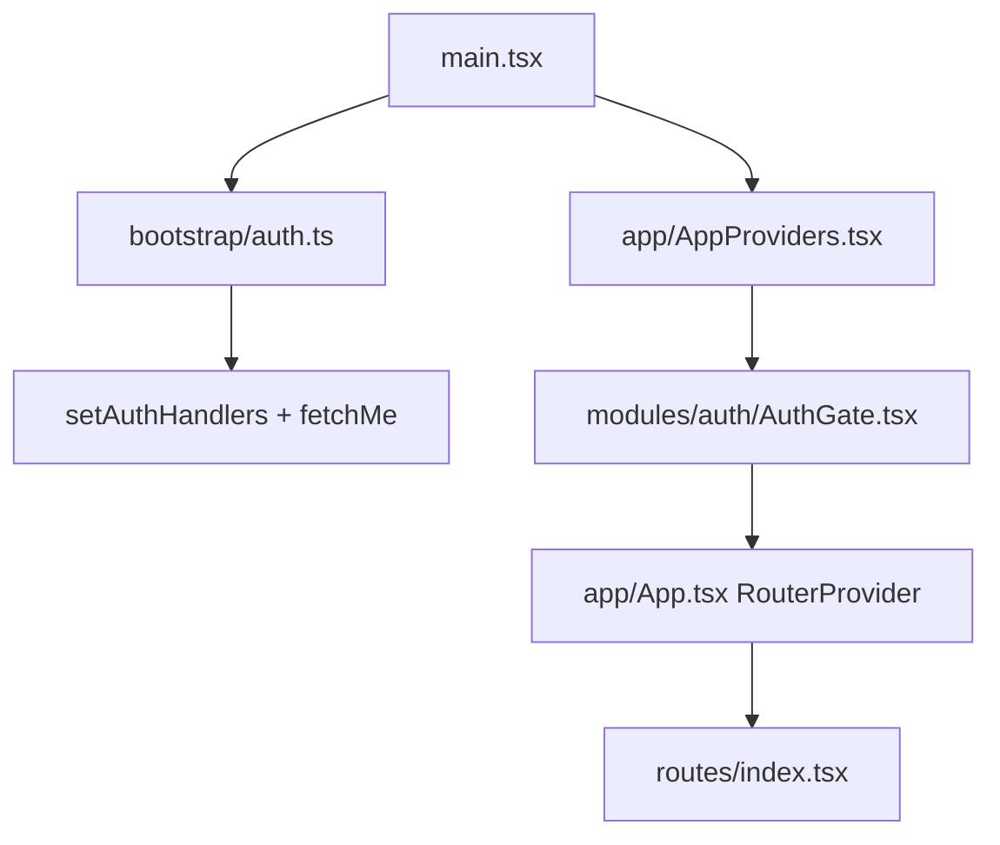
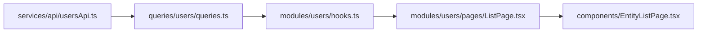

# HRIS Enterprise Frontend — Build Guide

**Literal build-order manual.** Follow sections **1 → 12** in sequence when scaffolding this app from scratch. Each step lists the files to create and the minimum code to wire before moving on.

- Quick start commands: [README.md](./README.md)
- Extended reference (all topics, more detail): [README_NOTES.md](./README_NOTES.md)

---

## Prerequisites

**Stack:**

| Layer | Technology |
|-------|------------|
| UI | React 19, TypeScript, Tailwind CSS 4 |
| Build | Vite 8 |
| Routing | react-router-dom v7 (`createBrowserRouter`) |
| Client state | Redux Toolkit (`auth`, `ui` slices only) |
| Server state | TanStack Query v5 |
| HTTP | Axios |
| Forms (auth) | react-hook-form + zod |
| UI primitives | shadcn/ui + Radix (`radix-nova` style) |
| Toasts | Sonner |

**Environment:**

```bash
npm install
cp .env.example .env
```

| Variable | Purpose |
|----------|---------|
| `VITE_API_BASE_URL` | Backend origin (default `http://localhost:3000`) |
| `VITE_APP_ENV` | Environment label for Sentry |
| `VITE_SENTRY_DSN` | Optional error reporting |

**Path alias:** `@/*` → `src/*`

### Bootstrap flow (runtime — wired in §6)



| File | Role |
|------|------|
| [`src/main.tsx`](src/main.tsx) | `bootstrapAuth(store)` then render |
| [`src/bootstrap/auth.ts`](src/bootstrap/auth.ts) | Auth handlers + `fetchMe` on load |
| [`src/app/AppProviders.tsx`](src/app/AppProviders.tsx) | Redux, providers, `AuthGate`, `Toaster` |
| [`src/app/App.tsx`](src/app/App.tsx) | `<RouterProvider />` only |

---

# 1. Project Structure

### Before anything else, decide your folders.

```
src/
├── app/              # App.tsx, AppProviders.tsx, providers/, instrumentation.ts
├── bootstrap/        # bootstrapAuth (§6)
├── components/
│   ├── layout/       # Shell chrome (§8)
│   └── ui/           # shadcn primitives (§2)
├── constants/        # routes, endpoints, navigation, permissions
├── hooks/
├── layouts/          # PublicLayout, AuthLayout, DashboardLayout (§3, §8)
├── lib/              # queryClient, queryKeys
├── modules/          # Feature domains — NOT features/ or top-level pages/
│   └── auth/         # AuthGate, pages/, schemas.ts (§6)
├── queries/          # TanStack Query hooks (§11)
├── routes/           # index.tsx, lazyRoutes.tsx, protectedRoute.tsx (§4)
├── services/         # httpClient, api/* (§5, §11)
├── slices/           # authSlice, uiSlice (§6, §7)
├── store/
├── test/
├── types/
├── ui/               # Design-system barrel (§2)
└── utils/
```

## Decide upfront

- **Auth split** — `modules/auth/` = UI; `slices/authSlice.ts` = session state
- **Module-based** under `modules/` — no cross-module imports (ESLint boundaries)
- **Redux** — `auth` + `ui` only; no feature slices
- **Queries** — live in `queries/`, re-exported from `modules/<domain>/hooks.ts`
- **Page exports** — named exports for `React.lazy()` pattern
- **Testing** — Vitest (Jest-compatible API)

---

# 2. LAYOUTS AND COMPONENTS LAYOUT

### Build the application's skeleton.

## LAYOUTS
Create the skeleton:

    layouts/
    ├── AuthLayout.tsx
    ├── DashboardLayout.tsx
    ├── PublicLayout.tsx
Example:

        AuthLayout.tsx
        ├── Header
        ├── Outlet / Content
        └── Footer
    
        DashboardLayout.tsx
        ├── AppSidebar
        ├── AppHeader
        ├── Outlet / Content
        └── AppFooter
    
        PublicLayout.tsx
        ├── Sidebar
        ├── Header
        ├── Content
        └── Footer

## COMPONENTS LAYOUT
Create the skeleton:

    components/layout
    ├── AppBreadcrumbs.tsx
    ├── AppFooter.tsx
    ├── AppHeader.tsx
    ├── AppSidebar.tsx
    ├── GlobalSearch.tsx
    ├── MessageInbox.tsx
    ├── NotificationBell.tsx
    ├── PageShell.tsx
    ├── PublicNavbar.tsx

-----------------------------------------------------------------------------------


# 3. Routing FE

Install:
```sh
    npm install react-router-dom
```

Create the skeleton:

    /routes
    ├── index.tsx
    ├── lazyRoutes.ts
    ├── protectedRoutes.tsx

    /constants
    ├── routes.ts

    /modules
    ├── public
    │   ├── pages/LandingPage
    ├── auth
    │   ├── pages/LoginPage
    ├── dashboard
    │   ├── pages/DashboardPage

    /components
    │   ├── ui/skeleton.tsx
    ├── PageLoader.tsx

### /components/ui/skeleton
creates skeleton ui for the Lazy.AnyPage and used in the loader
```tsx
    import { cn } from '@/lib/utils'
    export default function Skeleton({className, ...props}: React.ComponentProps<"div">){
        return(
            <div
                data-slot="skeleton"
                className={cn("animate-pulse rounded-md bg-muted", className)}
                {...props}
            />
        )
    }
```    
### /components/PageLoader.tsx
```tsx
    import Skeleton from "@/components/ui/skeleton"
    export function PageLoader(): React.JSX.Element {
        return (
            <div className="flex min-h-[200px] flex-col gap-3 p-4">
                <Skeleton className="h-8 w-1/3" />
                <div className="mt-4 space-y-3">
                    <Skeleton className="h-10 w-full" />
                </div>
            </div>
        )
    }
```

### /constants/routes.ts:
```ts
    export const ROUTES = {
       landing: '/',
       login: '/auth/login',
       dashboard: '/dashboard' 
    } as const
```

## Layouts for route - /src/layouts
### AuthLayout
```tsx
    import { Outlet } from 'react-router-dom'
    export default function AuthLayout(): React.JSX.Element {
        return (
            <div className="flex min-h-screen flex-col bg-muted">
                <header className="border-b border-border bg-card px-6 py-4">
                    Header
                </header>
                <div className="flex flex-1 items-center justify-center p-4">
                    <div className="w-full max-w-md rounded-lg border border-border bg-card p-8 shadow-sm">
                    <Outlet />
                    </div>
                </div>
            </div>
        )
}
```
### PublicLayout
```tsx
    import { Outlet } from 'react-router-dom'
    export default function PublicLayout(): React.JSX.Element {
        return (<Outlet />)
    }
```
### DashboardPage
```tsx 
    export function DashboardPage(): React.JSX.Element {
        return(<h1>DASHBOARD - this should be protected by ahout</h1>)
    }
```

## ROUTES
### /routes/lazyRoutes.ts
```ts
    import { lazy } from 'react'
    export const LandingPage = lazy(() =>
        import('@/modules/public/pages/LandingPage').then((m) => ({ default: m.LandingPage })),
    )
    export const LoginPage = lazy(() =>
        import('@/modules/auth/pages/LoginPage').then((m) => ({default: m.LoginPage}))
    )
    export const Dashboard = lazy (() =>
        import('@/modules/dashboard/pages/DashboardPage').then((m) => ({default: m.DashboardPage}))
    )
```
### /routes/protectedRoutes.ts
```tsx
    export default function ProtectedRoute(): React.JSX.Element {
        return(<></>)
    }
```    

### /routes/index.tsx
Includes: Suspense wrap, lazy loading and Page Loader
```tsx
    import AuthLayout from "@/layouts/AuthLayout";
    import DashboardLayout from "@/layouts/DashboardLayout";
    import PublicLayout from "@/layouts/PublicLayout";
    import { Suspense, type ReactNode } from "react";
    import { createBrowserRouter, Navigate } from 'react-router-dom'
    interface SuspenseWrapProps {
        children: ReactNode
    }
    function SuspenseWrapProp({children}: SuspenseWrapProps): React.JSX.Element
    {
        return<Suspense fallback="">{children}</Suspense>
    }

    export const router = createBrowserRouter([
        {
            element: <PublicLayout />,
            children: [
                //e.g:
                //{ index: true, element: <SuspenseWrap><Lazy.LandingPage /></SuspenseWrap> },
                //{ path: 'about', element: <SuspenseWrap><Lazy.AboutPage /></SuspenseWrap> },
                { index: true, element: <SuspenseWrap><Lazy.LandingPage /> </SuspenseWrap> },
                {}
            ]
        },
        {
            path: '/auth',
            element: <AuthLayout />,
            children: [
                { path: 'login', index: true, element: <Suspense> <Lazy.LoginPage /> </Suspense> },
                { path: '', element: <Suspense> <Lazy.LoginPage /> </Suspense> }
            ]
        },
        {
            element: <ProtectedRoute />,
            children: [
                {
                    element: <DashboardLayout />,
                    children: [
                        { path: 'dashboard', element: <SuspenseWrap> <Lazy.Dashboard /> </SuspenseWrap>},
                        //{ path: 'users', element: <SuspenseWrap><Lazy.UsersListPage /></SuspenseWrap> },
                    ]
                },
            ]
        },
        { path: 'logout', element: <Navigate to={ROUTES.login} replace /> },
        { path: '*', element: <Navigate to={ROUTES.landing} replace /> }
    ])
```

### src/App.tsx updates
```tsx
    import { RouterProvider } from 'react-router-dom'
    import { router } from '@/routes/index'
    export default function App(): React.JSX.Element {
        return (<RouterProvider router={router} />)
    }
```
---------------------------------------------------------------------------

# 4. UI Primitives

### Install shadcn primitives
Install via shadcn CLI
```sh
    npx shadcn@latest add button
    npx shadcn@latest add input
    npx shadcn@latest add label
    npx shadcn@latest add form
    npx shadcn@latest add card
    npx shadcn@latest add skeleton
```

Add more primitives later as features need them (`table`, `dialog`, `sheet`, etc.).

### UI barrel `src/ui/index.ts`
[`src/ui/index.ts`] re-exports of common primitives:

### Flow:
`src/components/ui/{tooltip}` => `src/ui/{ToolTip}` => `src/ui/index.ts` => `src/app/providers/{TooltipProvider.tsx}`

### Explanation:
`src/components/ui/{tooltip}` - small ui which came form shadcn-ui
`src/ui/{ToolTip}` - GROUP of multiple chadcn-ui
`src/ui/index.ts` - Barrel, COMPOSITION Group of multiple chadcn-ui****
`src/app/providers/{TooltipProvider.tsx}` - Implementation layer. can be  Module or in App

`src/ui` is for 


```ts
    export { Button, buttonVariants } from '@/components/ui/button'
    export { Input } from '@/components/ui/input'
    export { Label } from '@/components/ui/label'
    export { Textarea } from '@/components/ui/textarea'
    export { Select } from './Select'
    export { Modal } from './Modal'
    export { Dropdown } from './Dropdown'
    export { Tooltip, TooltipProvider } from './Tooltip'
    export { Tabs } from './Tabs'
    export {
        Table,
        TableHeader,
        TableBody,
        TableRow,
        TableHead,
        TableCell,
    } from '@/components/ui/table'
```
----------------------------------------------------------------------------------

---

# 4. Routing

### Wire public and auth routes first. Protected dashboard routes come in §8.

## File skeleton

```
routes/
├── index.tsx
├── lazyRoutes.tsx
└── protectedRoute.tsx
constants/
└── routes.ts
```

### `constants/routes.ts`

```ts
export const ROUTES = {
  landing: '/',
  about: '/about',
  pricing: '/pricing',
  contact: '/contact',
  home: '/dashboard',
  login: '/auth/login',
  register: '/auth/register',
  forgotPassword: '/auth/forgot-password',
  users: '/users',
  employees: '/employees',
  // … add dashboard paths as you build modules
} as const
```

### `lazyRoutes.tsx` — named export pattern

```tsx
import { lazy } from 'react'

export const LandingPage = lazy(() =>
  import('@/modules/public/pages/LandingPage').then((m) => ({ default: m.LandingPage })),
)
export const LoginPage = lazy(() =>
  import('@/modules/auth/pages/LoginPage').then((m) => ({ default: m.LoginPage })),
)
```

### `index.tsx` — Public + Auth only (phase 1)

```tsx
import { Suspense, type ReactNode } from 'react'
import { createBrowserRouter, Navigate } from 'react-router-dom'
import { AuthLayout } from '@/layouts/AuthLayout'
import { PublicLayout } from '@/layouts/PublicLayout'
import { PageLoader } from '@/components/PageLoader'
import { ROUTES } from '@/constants/routes'
import * as Lazy from './lazyRoutes'

function SuspenseWrap({ children }: { children: ReactNode }): React.JSX.Element {
  return <Suspense fallback={<PageLoader />}>{children}</Suspense>
}

export const router = createBrowserRouter([
  {
    element: <PublicLayout />,
    children: [
      { index: true, element: <SuspenseWrap><Lazy.LandingPage /></SuspenseWrap> },
    ],
  },
  {
    path: '/auth',
    element: <AuthLayout />,
    children: [
      { path: 'login', element: <SuspenseWrap><Lazy.LoginPage /></SuspenseWrap> },
      { path: 'register', element: <SuspenseWrap><Lazy.RegisterPage /></SuspenseWrap> },
      { path: 'forgot-password', element: <SuspenseWrap><Lazy.ForgotPasswordPage /></SuspenseWrap> },
    ],
  },
  { path: '/login', element: <Navigate to={ROUTES.login} replace /> },
  { path: '*', element: <Navigate to={ROUTES.landing} replace /> },
])
```

### `protectedRoute.tsx` (stub — used in §8)

```tsx
// src/routes/protectedRoute.tsx
import { Navigate, Outlet } from 'react-router-dom'
import { useAppSelector } from '@/hooks'
import { selectIsAuthenticated } from '@/slices/authSlice'
import { ROUTES } from '@/constants/routes'

export function ProtectedRoute(): React.JSX.Element {
  const isAuthenticated = useAppSelector(selectIsAuthenticated)
  if (!isAuthenticated) return <Navigate to={ROUTES.login} replace />
  return <Outlet />
}
```

## Checklist: Add a route later

1. `ROUTES.<name>` in `constants/routes.ts`
2. Named export page in `modules/<domain>/pages/`
3. Lazy export in `lazyRoutes.tsx`
4. Register under correct layout in `index.tsx`

---

# 5. API Layer (auth minimum)

### HTTP client and auth API before LoginPage can call the backend.

## Token storage

| Key | Purpose |
|-----|---------|
| `hris_access_token` | JWT access token |
| `hris_refresh_token` | Refresh token |
| `hris_tenant_id` | Multi-tenant header |

## `httpClient.ts`

```ts
// src/services/httpClient.ts — essentials
export const httpClient = axios.create({
  baseURL: `${import.meta.env.VITE_API_BASE_URL ?? 'http://localhost:3000'}/api/v1`,
})

httpClient.interceptors.request.use((config) => {
  if (accessToken) config.headers.Authorization = `Bearer ${accessToken}`
  if (tenantId) config.headers['X-Tenant-Id'] = tenantId
  return config
})

export function setAuthHandlers(handlers: { refresh: () => Promise<string | null>; unauthorized: () => void }): void
export function setAccessToken(token: string | null): void
export function getAccessToken(): string | null
export function clearAuthStorage(): void
```

401 interceptor queues requests and calls `onRefresh` once (wired in §6).

## `authApi.ts`

```ts
// src/services/api/authApi.ts
import { httpClient, getRefreshToken } from '@/services/httpClient'
import { endpoints } from '@/constants/endpoints'

export async function login(payload: LoginPayload): Promise<LoginResult> {
  const res = await httpClient.post<ApiResponse<LoginResult>>(endpoints.auth.login, payload)
  return res.data.data
}

export async function logout(): Promise<void> {
  const refreshToken = getRefreshToken()
  await httpClient.post(endpoints.auth.logout, refreshToken ? { refreshToken } : undefined)
}

export async function fetchMe(): Promise<User> {
  const res = await httpClient.get<ApiResponse<User>>(endpoints.auth.me)
  return res.data.data
}
```

## `errors.ts`

[`src/services/errors.ts`](src/services/errors.ts) — `normalizeApiError()` for auth slice and query toasts.

> **Defer to §11:** `createResourceApi`, per-domain APIs, full `endpoints.ts` beyond auth paths.

---

# 6. Authentication Foundation

### Session state, bootstrap, LoginPage, and app shell. Requires §2 (UI), §4 (routes), §5 (API).

## Auth file map

| Concern | File |
|---------|------|
| Login UI | `src/modules/auth/pages/LoginPage.tsx` |
| Register / forgot | `src/modules/auth/pages/RegisterPage.tsx`, `ForgotPasswordPage.tsx` |
| Schemas | `src/modules/auth/schemas.ts` |
| Session gate | `src/modules/auth/AuthGate.tsx` |
| Session state | `src/slices/authSlice.ts` |
| Bootstrap | `src/bootstrap/auth.ts` |
| Route guard | `src/routes/protectedRoute.tsx` |

## Store shell

```ts
// src/store/rootReducer.ts
import { combineReducers } from '@reduxjs/toolkit'
import { authReducer } from '@/slices/authSlice'

export const rootReducer = combineReducers({ auth: authReducer })
```

```ts
// src/store/index.ts
export const store = configureStore({ reducer: rootReducer })
export type RootState = ReturnType<typeof store.getState>
export type AppDispatch = typeof store.dispatch
export type AppStore = typeof store
```

## `authSlice.ts` — login thunk

```ts
export const login = createAsyncThunk('auth/login', async (payload, { rejectWithValue }) => {
  try {
    return await authApi.login(payload)
  } catch (e) {
    return rejectWithValue(normalizeApiError(e).message)
  }
})

// login.fulfilled: set user, tokens, tenantId, isAuthenticated = true
```

## LoginPage

```tsx
// src/modules/auth/pages/LoginPage.tsx
void dispatch(login(data)).then((result) => {
  if (login.fulfilled.match(result)) navigate(ROUTES.home)
})
```

Uses RHF + zod (`loginSchema`) and shadcn `Form`, `Button`, `Input`, `Card` from §2.

## Auth routes

| Route | Page | Layout |
|-------|------|--------|
| `/auth/login` | `LoginPage` | `AuthLayout` |
| `/auth/register` | `RegisterPage` | `AuthLayout` |
| `/auth/forgot-password` | `ForgotPasswordPage` | `AuthLayout` |
| `/dashboard` (`ROUTES.home`) | post-login destination | `DashboardLayout` (§8) |

## Bootstrap + app entry

```ts
// src/bootstrap/auth.ts
export function bootstrapAuth(store: AppStore): void {
  setAuthHandlers({
    refresh: async () => {
      const result = await store.dispatch(refreshSession())
      if (refreshSession.fulfilled.match(result)) return result.payload
      return null
    },
    unauthorized: () => { void store.dispatch(refreshSession()) },
  })
  if (getAccessToken()) void store.dispatch(fetchMe())
}
```

```tsx
// src/main.tsx
bootstrapAuth(store)
createRoot(root).render(
  <StrictMode>
    <AppProviders store={store}><App /></AppProviders>
  </StrictMode>,
)
```

```tsx
// src/app/AppProviders.tsx — wrap with Provider, QueryProvider, ThemeProvider, AuthGate
// src/app/App.tsx
export function App() {
  return <RouterProvider router={router} />
}
```

## AuthGate

Shows full-page `PageLoader` while token exists but `user === null` (session restoring via `fetchMe`).

## Layout guards

| Layout / guard | Behavior |
|----------------|----------|
| `PublicLayout` | Authenticated → `/dashboard` |
| `AuthLayout` | Authenticated → `/dashboard` |
| `ProtectedRoute` | Unauthenticated → `/auth/login` |

## Permissions

- `user.permissions` from login / `GET /auth/me` (role-based on BE)
- `usePermission()` reads Redux `user.permissions`; admin role bypasses checks
- Sidebar filters via `constants/navigation.ts` — route/action gating optional

## Logout

`AppHeader` → `logout` thunk → best-effort API → always clear storage → redirect to `ROUTES.login`.

---

# 7. Global UI State

### Add `uiSlice` before dashboard chrome (sidebar toggle, theme, command palette).

[`src/slices/uiSlice.ts`](src/slices/uiSlice.ts):

| State | Actions |
|-------|---------|
| `sidebarOpen` | `toggleSidebar`, `setSidebarOpen` |
| `theme` | `setTheme` |
| `commandPaletteOpen` | `setCommandPaletteOpen` |
| `expandedNavGroups` | `toggleNavGroup` |
| `sidebarSearchQuery` | `setSidebarSearchQuery` |

```ts
// src/store/rootReducer.ts — add ui
export const rootReducer = combineReducers({
  auth: authReducer,
  ui: uiReducer,
})
```

Theme: [`src/hooks/useTheme.ts`](src/hooks/useTheme.ts) + [`src/components/ThemeProvider.tsx`](src/components/ThemeProvider.tsx).

---

# 8. Dashboard Shell and Protected Routes

### Layout chrome + protected router branch. Requires §7 (`uiSlice`).

## `components/layout/`

```
components/layout/
├── AppSidebar.tsx      # Nav groups, permission filter
├── AppHeader.tsx       # User menu, logout, breadcrumbs
├── AppFooter.tsx
├── PublicNavbar.tsx
├── PageShell.tsx
├── AppBreadcrumbs.tsx
└── …
```

## DashboardLayout

```tsx
// src/layouts/DashboardLayout.tsx — simplified
<div className="flex min-h-screen">
  <aside>{/* AppSidebar — ui.sidebarOpen */}</aside>
  <div className="flex min-w-0 flex-1 flex-col">
    <AppHeader />
    <main className="flex flex-1 flex-col overflow-auto p-6"><Outlet /></main>
    <AppFooter />
  </div>
</div>
```

## Complete protected routes in `index.tsx`

```tsx
{
  element: <ProtectedRoute />,
  children: [{
    element: <DashboardLayout />,
    children: [
      { path: 'dashboard', element: <SuspenseWrap><Lazy.DashboardPage /></SuspenseWrap> },
      { path: 'users', element: <SuspenseWrap><Lazy.UsersListPage /></SuspenseWrap> },
      // …
    ],
  }],
},
```

## Navigation metadata

- [`src/constants/navigation.ts`](src/constants/navigation.ts) — sidebar groups + optional `permission` per item
- [`src/constants/routeMeta.ts`](src/constants/routeMeta.ts) — page titles and breadcrumbs

---

# 9. Shared App Components

### CRUD and page scaffolding — after auth and dashboard shell.

| Component | Purpose |
|-----------|---------|
| `EntityListPage` | Generic searchable table (active/trashed tabs) |
| `EntityFormDialog` | Create/edit dialog (name + status) |
| `ConfirmDialog` | Soft delete, restore, hard delete |
| `PageShell` | Dashboard page wrapper (title, toolbar, breadcrumbs) |
| `PageLoader` | Suspense fallback (§2) |
| `EmptyState` | Empty list placeholder |
| `MetricsDashboard` | Dashboard metrics cards |
| `EmployeeActionDialog` | Promote/transfer flows |

**Principle:** shadcn = behavior; Tailwind = styling; these components = app conventions.

---

# 10. Vitest + React Testing Library

> **Vitest**, not Jest. API is Jest-compatible.

```
src/test/
├── setup.ts
├── utils.tsx             # renderWithProviders
├── fixtures.ts
├── unit/
└── integration/
```

[`vitest.config.ts`](vitest.config.ts): `jsdom`, globals, `src/test/setup.ts`, alias `@`.

| Command | Purpose |
|---------|---------|
| `npm run test` | Unit tests |
| `npm run test:integration` | Live API (needs BE) |
| `npm run test:all` | Unit + integration + E2E |

**Test first:** `uiSlice`, `PublicNavbar`, auth schemas, `LoginPage`, `queries/factory.ts`.

Use [`renderWithProviders`](src/test/utils.tsx) — Redux + Query + Router + Theme.

---

# 11. API Resources + TanStack Query

### Per-domain APIs and query hooks for feature modules.

## API helpers

[`src/services/api/client.ts`](src/services/api/client.ts):

| Helper | Purpose |
|--------|---------|
| `apiGet`, `apiPost`, … | Unwrap `ApiResponse<T>.data` |
| `createResourceApi` | Read-only list + getById |
| `createMutableResourceApi` | CRUD + soft delete, restore, trashed |

```ts
// src/services/api/usersApi.ts
export const usersApi = createMutableResourceApi<UsersEntity>({
  list: endpoints.users.list,
  byId: endpoints.users.byId,
  trashed: endpoints.users.trashed,
  softDelete: endpoints.users.softDelete,
  restore: endpoints.users.restore,
})
```

## TanStack Query

| File | Role |
|------|------|
| `lib/queryClient.ts` | Singleton + global error toasts |
| `lib/queryKeys.ts` | Hierarchical keys per resource |
| `queries/factory.ts` | `createResourceQueryHooks()` |
| `queries/<domain>/queries.ts` | Wire factory to API |
| `modules/<domain>/hooks.ts` | Re-export query hooks |

```ts
// src/queries/users/queries.ts
const hooks = createResourceQueryHooks(queryKeys.users, usersApi)
export const useUsersList = hooks.useList
```



---

# 12. Feature Modules, E2E, Forms

### Standard module shape

```
modules/<domain>/
├── pages/ListPage.tsx    # Named export: <Domain>ListPage
├── hooks.ts              # Re-exports from @/queries
└── types.ts
```

### Auth module (exception)

```
modules/auth/
├── AuthGate.tsx
├── pages/LoginPage.tsx, RegisterPage.tsx, ForgotPasswordPage.tsx
└── schemas.ts
```

### Generic CRUD page

Use `useEntityCrudPage` + `EntityListPage` + `EntityFormDialog` + `ConfirmDialog` (see [`modules/users/pages/ListPage.tsx`](src/modules/users/pages/ListPage.tsx)).

## Checklist: New HR module

1. `modules/<domain>/types.ts`
2. Endpoints in `constants/endpoints.ts`
3. `services/api/<domain>Api.ts`
4. `lib/queryKeys.ts` entry
5. `queries/<domain>/queries.ts` + barrel
6. `modules/<domain>/hooks.ts` + `pages/ListPage.tsx`
7. Route checklist (§4)
8. Sidebar in `navigation.ts` + `routeMeta.ts`

## E2E (Cypress)

| Command | Purpose |
|---------|---------|
| `npm run cy:open` | Interactive runner |
| `npm run test:e2e` | Headless (starts dev server) |

Specs: `cypress/e2e/auth.cy.ts`, `features.cy.ts`, `navigation.cy.ts`

## Forms

| Page | Validation | Submit |
|------|------------|--------|
| LoginPage | zod + RHF | Redux `login` thunk |
| RegisterPage | zod + RHF | `authApi.register` → redirect login |
| ForgotPasswordPage | zod + RHF | `authApi.forgotPassword` |
| Entity CRUD | local state in `EntityFormDialog` | TanStack Query mutations |

---

# Build Order Summary

Follow this exact sequence:

1. **Project structure** — folders and conventions
2. **UI primitives** — shadcn minimum + `PageLoader` (before auth forms)
3. **Layouts** — `PublicLayout`, `AuthLayout`
4. **Routing** — public + auth routes, `lazyRoutes`, `SuspenseWrap`
5. **API layer** — `httpClient`, `authApi`, `errors`
6. **Authentication** — store, `authSlice`, `LoginPage`, bootstrap, `AuthGate`, `AppProviders`
7. **Global UI state** — `uiSlice`, theme
8. **Dashboard shell** — `components/layout/*`, `DashboardLayout`, protected routes
9. **Shared app components** — `EntityListPage`, dialogs, `PageShell`
10. **Vitest** — setup, `renderWithProviders`, first tests
11. **API resources + TanStack Query** — domain APIs, factory, query hooks
12. **Feature modules** — CRUD pages, Cypress, per-feature forms

---

# Known Gaps

| Topic | Reality |
|-------|---------|
| Test runner | **Vitest**, not Jest |
| Feature folder | **`modules/`**, not `features/` |
| Reset password | Constant exists; **no page or route** |
| Route permissions | `ProtectedRoute permissions` prop **not wired** |
| FE action permissions | Sidebar filter only; CRUD buttons **not gated** |
| Register | Does **not** auto-login |
| Integration tests | Require **live backend** |
| Entity forms | `EntityFormDialog` uses local state, not RHF/zod |
| Cross-module imports | **Forbidden** by ESLint |

---

# Quick Reference: Key Files

| Area | Path |
|------|------|
| Entry | `src/main.tsx` |
| Auth bootstrap | `src/bootstrap/auth.ts` |
| App providers | `src/app/AppProviders.tsx`, `src/app/providers/` |
| Router shell | `src/app/App.tsx` |
| Auth gate | `src/modules/auth/AuthGate.tsx` |
| Login page | `src/modules/auth/pages/LoginPage.tsx` |
| Auth slice | `src/slices/authSlice.ts` |
| UI slice | `src/slices/uiSlice.ts` |
| HTTP + tokens | `src/services/httpClient.ts` |
| Auth API | `src/services/api/authApi.ts` |
| API factory | `src/services/api/client.ts` |
| Routes | `src/routes/index.tsx`, `lazyRoutes.tsx`, `protectedRoute.tsx` |
| Route paths | `src/constants/routes.ts` |
| Navigation | `src/constants/navigation.ts` |
| Query client | `src/lib/queryClient.ts` |
| Query factory | `src/queries/factory.ts` |
| CRUD UI | `src/components/EntityListPage.tsx` |
| Auth schemas | `src/modules/auth/schemas.ts` |
| shadcn config | `components.json` |
| Vitest | `vitest.config.ts` |
| Test utils | `src/test/utils.tsx` |
