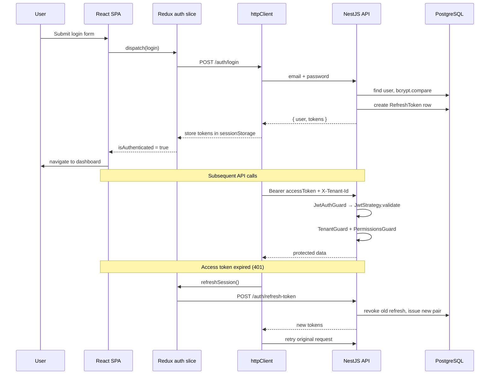

---
description: Complete HRIS authentication walkthrough — JWT access tokens, opaque refresh tokens, bcrypt, RBAC, multi-tenant isolation, BE+FE implementation and testing from no auth
globs: src/**/*auth*,src/slices/authSlice.ts,src/services/httpClient.ts,src/bootstrap/**,src/routes/**,src/hooks/usePermission.ts
alwaysApply: false
---

# Authentication in HRIS — Full Walkthrough

This app uses **stateless JWT access tokens** plus **opaque refresh tokens stored server-side**, with **bcrypt password hashing**, **RBAC permissions**, and **multi-tenant isolation**. Below is how it is installed, configured, implemented, and tested — described as if you were building it from **no auth**.

---

## Authentication method (summary)

| Layer | Method |
|--------|--------|
| **Credentials** | Email + password |
| **Password storage** | `bcrypt` hash (cost 10) in PostgreSQL |
| **Access token** | Short-lived **JWT** (`Authorization: Bearer <token>`) |
| **Refresh token** | Random 96-char hex string, **SHA-256 hashed** in DB (not a JWT) |
| **Session restore** | FE calls `GET /auth/me` on load if access token exists |
| **Authorization** | RBAC: roles → permissions, enforced on BE and FE |
| **Multi-tenant** | `tenantId` in JWT + `X-Tenant-Id` header on requests |
| **Token storage (FE)** | `sessionStorage` (cleared when tab closes) |

This is **not** cookie/session-based auth, OAuth, or SSO. It is a classic **SPA + REST API JWT pattern** with refresh-token rotation.

---

## High-level architecture



---

# Part 1 — Backend (NestJS): from no auth to full auth

## Step 1 — Install dependencies

From `BE/package.json`, auth-related packages:

- `@nestjs/jwt`, `@nestjs/passport`, `passport`, `passport-jwt` — JWT validation
- `bcrypt` — password hashing
- `@prisma/client` + PostgreSQL — users and refresh tokens
- `ioredis` — session revocation marker on logout

```bash
npm install @nestjs/jwt @nestjs/passport passport passport-jwt bcrypt
npm install -D @types/passport-jwt @types/bcrypt
```

## Step 2 — Configure environment

`BE/.env.example` defines:

```env
JWT_ACCESS_SECRET=change-me-access-secret-min-32-chars
JWT_REFRESH_SECRET=change-me-refresh-secret-min-32-chars   # defined but refresh tokens are opaque, not JWT-signed
JWT_ACCESS_EXPIRES=15m
JWT_REFRESH_EXPIRES=7d
CORS_ORIGIN=http://localhost:5173
DATABASE_URL=postgresql://...
```

Loaded via `BE/src/config/configuration.ts`:

```typescript
  jwt: {
    accessSecret:
      process.env.JWT_ACCESS_SECRET ?? 'dev-access-secret-change-in-production',
    refreshSecret:
      process.env.JWT_REFRESH_SECRET ??
      'dev-refresh-secret-change-in-production',
    accessExpires: process.env.JWT_ACCESS_EXPIRES ?? '15m',
    refreshExpires: process.env.JWT_REFRESH_EXPIRES ?? '7d',
  },
```

## Step 3 — Database schema (users + refresh tokens + RBAC)

In `BE/prisma/schema.prisma`:

- **`User`**: `email`, `passwordHash`, `tenantId`, `role`, `isActive`
- **`RefreshToken`**: `tokenHash`, `expiresAt`, `revokedAt` (rotation/revocation)
- **`Role` / `Permission` / `UserRole` / `RolePermission`**: RBAC

```prisma
model User {
  id            String         @id @default(uuid())
  tenantId      String
  email         String
  passwordHash  String
  ...
  refreshTokens RefreshToken[]
  userRoles     UserRole[]
  ...
}

model RefreshToken {
  id        String    @id @default(uuid())
  userId    String
  tokenHash String
  expiresAt DateTime
  revokedAt DateTime?
  ...
}
```

## Step 4 — Seed a demo admin user

`BE/prisma/seed.ts` creates `admin@hris.com` / `password` with `role: 'admin'` and assigns role permissions.

## Step 5 — Create `AuthModule`

`BE/src/modules/auth/auth.module.ts`:

1. Register `PassportModule` with default strategy `'jwt'`
2. Register `JwtModule` async with access secret + expiry
3. Provide `AuthService` + `JwtStrategy`
4. Export `AuthService` for other modules

## Step 6 — Implement `AuthService`

Core logic in `BE/src/modules/auth/auth.service.ts`:

### Login

1. Find user by email (lowercased)
2. `bcrypt.compare(password, user.passwordHash)`
3. Reject if inactive user or suspended tenant
4. Load permissions from roles
5. Call `issueTokens()`

### Issue tokens

- **Access JWT** payload: `{ sub, tenantId, email, role }`, signed with `jwt.accessSecret`, expires `15m`
- **Refresh token**: `randomBytes(48).toString('hex')`, stored as SHA-256 hash in `RefreshToken` table, expires `7d`

```typescript
  async issueTokens(...): Promise<AuthTokens> {
    const payload = { sub: userId, tenantId, email, role };
    const accessToken = this.jwt.sign(payload, { secret: ..., expiresIn: '15m' });

    const refreshToken = randomBytes(48).toString('hex');
    const tokenHash = this.hashToken(refreshToken);
    ...
    await this.prisma.refreshToken.create({ data: { userId, tokenHash, expiresAt } });
    return { accessToken, refreshToken };
  }
```

### Refresh (rotation)

1. Hash incoming refresh token, find non-revoked row
2. **Revoke** old token (`revokedAt = now`)
3. Issue **new** access + refresh pair

### Logout

1. Revoke refresh token(s) in DB
2. Set Redis key `session:revoked:${userId}` (24h TTL) for optional session invalidation

### Register / change-password

- Register hashes password with `bcrypt.hash(..., 10)`
- `forgotPassword`, `resetPassword`, `verifyEmail` are **stubs** (not fully implemented)

## Step 7 — JWT Passport strategy

`BE/src/modules/auth/strategies/jwt.strategy.ts`:

- Extracts JWT from `Authorization: Bearer`
- On `validate(payload)`:
  - Reload user from DB (ensures still active)
  - Resolve permissions from roles
  - Admin gets all permissions
  - Returns `RequestUser` attached to `req.user`

## Step 8 — Auth controller + public routes

`BE/src/modules/auth/auth.controller.ts` exposes:

| Endpoint | Public? | Purpose |
|----------|---------|---------|
| `POST /auth/login` | Yes | Login |
| `POST /auth/refresh-token` | Yes | Refresh |
| `POST /auth/register` | Yes | Register |
| `POST /auth/forgot-password` | Yes | Stub |
| `POST /auth/reset-password` | Yes | Stub |
| `GET /auth/me` | No | Current user profile |
| `POST /auth/logout` | No | Logout |
| `POST /auth/change-password` | No | Change password |

`@Public()` decorator skips JWT guard:

```typescript
export const IS_PUBLIC_KEY = 'isPublic';
export const Public = () => SetMetadata(IS_PUBLIC_KEY, true);
```

## Step 9 — Global guards (protect everything by default)

`BE/src/app.module.ts` registers **global** guards in order:

1. `ThrottlerGuard` — rate limiting
2. `JwtAuthGuard` — requires valid JWT unless `@Public()`
3. `TenantGuard` — validates `X-Tenant-Id` matches user's tenant
4. `PermissionsGuard` — checks `@Permissions(...)` metadata on handlers

```typescript
    { provide: APP_GUARD, useClass: ThrottlerGuard },
    { provide: APP_GUARD, useClass: JwtAuthGuard },
    { provide: APP_GUARD, useClass: TenantGuard },
    { provide: APP_GUARD, useClass: PermissionsGuard },
```

## Step 10 — Bootstrap API (CORS, prefix, Swagger)

`BE/src/main.ts`:

- Global prefix: `api/v1`
- CORS allows `Authorization` and `X-Tenant-Id`
- Swagger with `.addBearerAuth()`
- Validation pipe on DTOs

## Step 11 — Test backend auth

**E2E** (`BE/test/app.e2e-spec.ts`):

1. `POST /api/v1/auth/login` with seeded credentials
2. Use returned `accessToken` + `tenantId` on protected routes (`/auth/me`, `/employees`, etc.)

```bash
cd BE
docker compose up -d
npx prisma migrate dev
npm run prisma:seed
npm run start:dev
npm run test:e2e
```

There are **no dedicated unit tests** for `AuthService` — auth is covered by e2e smoke tests.

---

# Part 2 — Frontend (React): from no auth to full auth

## Step 1 — Install dependencies

From `FE/package.json`:

- `@reduxjs/toolkit`, `react-redux` — auth state
- `axios` — HTTP + interceptors
- `react-router-dom` — route protection
- `react-hook-form`, `zod`, `@hookform/resolvers` — login form validation

```bash
npm install @reduxjs/toolkit react-redux axios react-router-dom react-hook-form zod @hookform/resolvers
```

## Step 2 — Configure environment

`FE/.env`:

```env
VITE_API_BASE_URL=http://localhost:3000
```

Used in `httpClient.ts` to build base URL: `http://localhost:3000/api/v1`.

## Step 3 — HTTP client with token injection + 401 refresh

`FE/src/services/httpClient.ts` is the auth transport layer:

1. **Storage**: `sessionStorage` keys `hris_access_token`, `hris_refresh_token`, `hris_tenant_id`
2. **Request interceptor**: adds `Authorization: Bearer` and `X-Tenant-Id`
3. **Response interceptor**: on `401`, calls registered `onRefresh()`, retries request, queues concurrent 401s during refresh

```typescript
httpClient.interceptors.request.use((config) => {
  if (accessToken) config.headers.Authorization = `Bearer ${accessToken}`
  if (tenantId) config.headers['X-Tenant-Id'] = tenantId
  return config
})
```

## Step 4 — Auth API layer

`FE/src/services/api/authApi.ts` maps to backend endpoints:

- `login()` → `POST /auth/login`
- `refreshToken()` → `POST /auth/refresh-token`
- `fetchMe()` → `GET /auth/me`
- `logout()` → `POST /auth/logout` (sends refresh token in body)

Endpoints defined in `FE/src/constants/endpoints.ts`.

## Step 5 — Redux auth slice

`FE/src/slices/authSlice.ts` manages session state:

| Thunk | What it does |
|-------|----------------|
| `login` | Calls API, stores tokens, sets `user`, `isAuthenticated` |
| `fetchMe` | Restores user profile on page reload |
| `refreshSession` | Exchanges refresh token for new pair |
| `logout` | Calls API (best-effort), clears storage |

Initial state: `isAuthenticated = Boolean(getAccessToken())` — optimistic if token exists in storage.

## Step 6 — Bootstrap auth before first render

`FE/src/main.tsx`:

```typescript
bootstrapAuth(store)
```

`FE/src/bootstrap/auth.ts` wires HTTP client ↔ Redux:

1. `setAuthHandlers({ refresh, unauthorized })` — connects 401 interceptor to `refreshSession`
2. If access token exists → `dispatch(fetchMe())` to load user + permissions

## Step 7 — App providers + session restore UI

`FE/src/app/AppProviders.tsx` wraps app with Redux and `AuthGate`.

`AuthGate` shows a loader while:

- token exists in storage
- `isAuthenticated === true`
- but `user === null` (waiting for `fetchMe`)

This prevents flashing protected UI before profile loads.

## Step 8 — Routing: public vs protected

`FE/src/routes/index.tsx`:

- **Public**: `/`, `/about`, `/auth/login`, `/auth/register`, etc.
- **Protected**: everything under `<ProtectedRoute />` (dashboard, users, employees, …)
- **Permission-gated**: nested `ProtectedRoute permissions={[...]}` for tenants, billing, admin health

`FE/src/routes/protectedRoute.tsx`:

```typescript
  const isAuthenticated = useAppSelector(selectIsAuthenticated)
  const { can } = usePermission()

  if (!isAuthenticated) return <Navigate to={ROUTES.login} replace />
  if (permissions?.length && !permissions.some((p) => can(p))) {
    return <Navigate to={ROUTES.home} replace />
  }
  return <Outlet />
```

## Step 9 — Login page UI

`FE/src/modules/auth/pages/LoginPage.tsx`:

1. `react-hook-form` + Zod schema (`email`, `password` min 6)
2. `dispatch(login(data))`
3. On success → `navigate(ROUTES.home)`

## Step 10 — Permission checks in UI

`FE/src/hooks/usePermission.ts`:

- Reads `user.permissions` from Redux
- `admin` role bypasses all checks (mirrors backend behavior)
- Used by `ProtectedRoute` and feature UIs

## Step 11 — Logout

`FE/src/components/layout/AppHeader.tsx`:

```typescript
  const handleLogout = (): void => {
    void dispatch(logout()).then((result) => {
      if (logout.fulfilled.match(result)) {
        navigate(ROUTES.login, { replace: true })
      }
    })
  }
```

---

# Part 3 — End-to-end flows

## Login flow

1. User visits `/auth/login`
2. Form submits → `authApi.login` → `POST /api/v1/auth/login`
3. BE validates credentials, returns `{ user, tokens }`
4. Redux stores user + tokens in `sessionStorage`
5. `tenantId` set for `X-Tenant-Id` header
6. Router navigates to home/dashboard

## Page reload / session restore

1. `main.tsx` calls `bootstrapAuth(store)`
2. Token found → `fetchMe()` → `GET /auth/me` with Bearer token
3. User + permissions loaded into Redux
4. `AuthGate` stops showing loader
5. Protected routes remain accessible

## API call with expired access token

1. Request returns `401`
2. Axios interceptor calls `refreshSession()`
3. `POST /auth/refresh-token` with refresh token
4. New tokens saved; original request retried
5. If refresh fails → storage cleared, user effectively logged out

## Logout flow

1. User clicks Log out
2. `POST /auth/logout` revokes refresh token on server
3. FE clears `sessionStorage` regardless of API success
4. Redirect to login

---

# Part 4 — Testing (layered)

## Layer 1 — Unit tests (Vitest, no backend)

| File | What it tests |
|------|----------------|
| `bootstrap/auth.test.ts` | Handlers registered; `fetchMe` dispatched when token exists |
| `modules/auth/AuthGate.test.tsx` | Loader during session restore; children when ready |

```bash
cd FE
npm run test
```

## Layer 2 — Integration tests (Vitest + live API)

Requires Docker Postgres + seeded BE:

```bash
npm run test:integration   # starts services + BE, runs vitest.integration.config.ts
```

| File | What it tests |
|------|----------------|
| `test/integration/LoginPage.integration.test.tsx` | Full login UI → Redux `isAuthenticated === true` |
| `test/integration/api.integration.test.ts` | Login API + protected endpoints |
| `test/integration/helpers.ts` | `seedAuthFromApi()` helper |

Uses credentials: `admin@hris.com` / `password`.

## Layer 3 — Cypress E2E (browser + live stack)

```bash
npm run test:e2e   # services:up + be:dev + vite dev + cypress
```

`cypress/e2e/auth.cy.ts`:

- Unauthenticated `/users` → redirect to `/auth/login`
- `cy.loginByApi()` fills login form, lands on dashboard
- Register / forgot-password navigation

`cypress/support/commands.ts` — custom `loginByApi` command.

## Layer 4 — Backend E2E

```bash
cd BE
npm run test:e2e
```

`test/app.e2e-spec.ts` — login + authenticated access to multiple modules.

---

# Part 5 — "From no auth" checklist (build order)

If you were greenfielding this pattern:

### Backend

1. Add User + RefreshToken models (Prisma migrate)
2. Install JWT/Passport/bcrypt
3. Create `AuthModule`, `AuthService`, `AuthController`
4. Add `JwtStrategy` + `@Public()` decorator
5. Register global `JwtAuthGuard`, `TenantGuard`, `PermissionsGuard`
6. Seed admin user
7. Configure CORS + env secrets
8. Write e2e login test

### Frontend

1. Create `httpClient` with interceptors
2. Create `authApi` service
3. Add `authSlice` to Redux store
4. Call `bootstrapAuth(store)` in `main.tsx`
5. Add `AuthGate`, `ProtectedRoute`, login page
6. Wire routes (public vs protected)
7. Add `usePermission` hook
8. Write unit + integration + Cypress tests

---

## Notable design choices

1. **Refresh tokens are opaque**, not JWT — only access tokens are JWTs.
2. **Refresh rotation** — each refresh revokes the old token and issues a new one.
3. **sessionStorage** — tokens don't persist across browser tabs/sessions like `localStorage` would.
4. **Defense in depth** — JWT on every request, tenant header validation, permission checks on BE; FE mirrors with `ProtectedRoute` + `usePermission` (UI-only; BE is authoritative).
5. **Stubs** — forgot/reset password and email verification exist as API routes but are not fully implemented on either side.

---

## Key file reference

### Frontend

| File | Role |
|------|------|
| `src/main.tsx` | Calls `bootstrapAuth(store)` before render |
| `src/bootstrap/auth.ts` | Wires HTTP refresh handlers + session restore |
| `src/services/httpClient.ts` | Axios instance, token storage, interceptors |
| `src/services/api/authApi.ts` | Auth API calls |
| `src/slices/authSlice.ts` | Redux auth state and thunks |
| `src/modules/auth/AuthGate.tsx` | Loader during session restore |
| `src/modules/auth/pages/LoginPage.tsx` | Login form UI |
| `src/routes/protectedRoute.tsx` | Auth + permission route guard |
| `src/routes/index.tsx` | Public vs protected route tree |
| `src/hooks/usePermission.ts` | Client-side permission checks |
| `src/app/AppProviders.tsx` | Redux + AuthGate wrapper |
| `src/components/layout/AppHeader.tsx` | Logout handler |
| `src/constants/endpoints.ts` | Auth endpoint paths |

### Backend

| File | Role |
|------|------|
| `src/modules/auth/auth.module.ts` | Auth module wiring |
| `src/modules/auth/auth.service.ts` | Login, tokens, refresh, logout |
| `src/modules/auth/auth.controller.ts` | Auth HTTP endpoints |
| `src/modules/auth/strategies/jwt.strategy.ts` | Passport JWT validation |
| `src/common/guards/jwt-auth.guard.ts` | Global JWT guard |
| `src/common/guards/tenant.guard.ts` | Tenant header validation |
| `src/common/guards/permissions.guard.ts` | RBAC enforcement |
| `src/common/decorators/public.decorator.ts` | Skip auth on public routes |
| `src/app.module.ts` | Global guard registration |
| `src/main.ts` | CORS, prefix, Swagger |
| `src/config/configuration.ts` | JWT env config |
| `prisma/schema.prisma` | User, RefreshToken, RBAC models |
| `prisma/seed.ts` | Demo admin user |

### Test files

| File | Role |
|------|------|
| `FE/src/bootstrap/auth.test.ts` | Bootstrap unit tests |
| `FE/src/modules/auth/AuthGate.test.tsx` | AuthGate unit tests |
| `FE/src/test/integration/LoginPage.integration.test.tsx` | Live API login UI test |
| `FE/src/test/integration/api.integration.test.ts` | Live API auth + endpoints |
| `FE/src/test/integration/helpers.ts` | `seedAuthFromApi()` helper |
| `FE/cypress/e2e/auth.cy.ts` | Browser E2E auth flows |
| `FE/cypress/support/commands.ts` | `cy.loginByApi()` command |
| `BE/test/app.e2e-spec.ts` | Backend E2E auth smoke tests |
