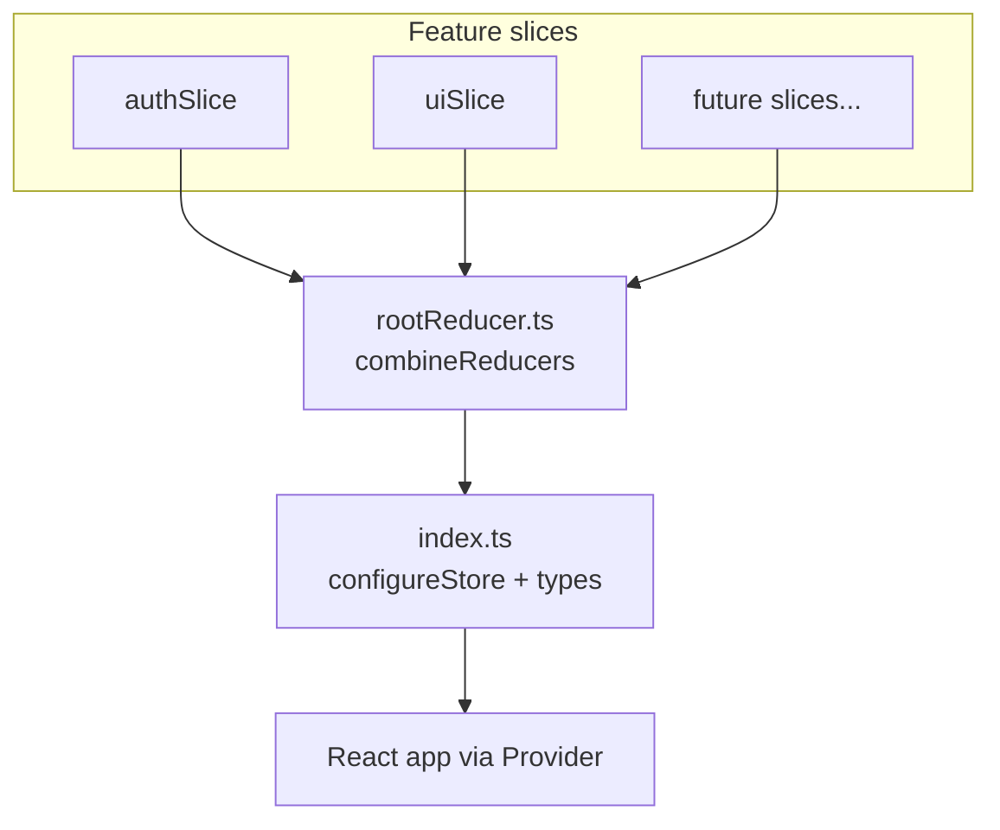

## Why `rootReducer.ts` is separate from `index.ts`

In your project, the split is intentional and common:

**`rootReducer.ts`** — *what* state exists and how slices are composed:

```1:8:src/store/rootReducer.ts
import { combineReducers } from '@reduxjs/toolkit'
import { authReducer } from '@/slices/authSlice'
import { uiReducer } from '@/slices/uiSlice'

export const rootReducer = combineReducers({
  auth: authReducer,
  ui: uiReducer,
})
```

**`index.ts`** — *how* the store is built and typed:

```1:14:src/store/index.ts
import { configureStore } from '@reduxjs/toolkit'
import { rootReducer } from './rootReducer'

export const store = configureStore({
  reducer: rootReducer,
  middleware: (getDefaultMiddleware) =>
    getDefaultMiddleware({
      serializableCheck: false,
    }),
})

export type RootState = ReturnType<typeof store.getState>
export type AppDispatch = typeof store.dispatch
export type AppStore = typeof store
```

Typical reasons for this split:

| Concern | `rootReducer.ts` | `index.ts` |
|--------|------------------|------------|
| Role | Combines slice reducers into one tree | Creates the store, middleware, devtools |
| Grows when… | You add domains (`auth`, `ui`, `billing`, …) | You add RTK Query APIs, listeners, persistence |
| Reuse | Can be imported in tests without full store setup | Single entry point for the app |

A practical benefit: you can test reducers with `rootReducer(initialState, action)` without spinning up middleware. You can also wrap `rootReducer` later (e.g. `reset on logout`) in one place without touching store config.

This is a standard Redux Toolkit pattern, not over-engineering.

---

## Is it normal to have other reducers?

Yes. Your app already has two:

- **`auth`** — session, user, login/logout async state
- **`ui`** — sidebar, theme, command palette, global loading

`combineReducers` is designed for exactly this: one reducer per domain, merged into `state.auth`, `state.ui`, etc.

You do **not** put everything in one giant reducer. You add slices as features grow.

---

## Other reducers you might add (enterprise apps)

Below are common slices/reducers in large apps. Not all belong in Redux — some are better in RTK Query, React Query, URL state, or local component state. Still, these are the usual Redux domains.

### Core platform

| Reducer key | Typical state | Enterprise use |
|-------------|---------------|----------------|
| **`auth`** *(you have this)* | user, tokens, roles, tenant | Login, SSO, session refresh, logout reset |
| **`ui`** *(you have this)* | theme, sidebar, modals, toasts | Shell UX shared across modules |
| **`app` / `config`** | feature flags, env, maintenance mode | Roll out features per tenant/region |
| **`session`** | active org/workspace, locale, timezone | Multi-tenant context switching |

### Data & API (often RTK Query instead of manual slices)

| Reducer key | Typical state | Enterprise use |
|-------------|---------------|----------------|
| **`api`** (RTK Query) | caches, loading, errors per endpoint | Centralized server state; you’d add `authApi`, `usersApi`, etc. |
| **`entities`** | normalized `users`, `orders`, `invoices` by id | Large lists, cross-screen references, fewer duplicate fetches |
| **`pagination` / `filters`** | page, sort, search per resource | Tables with shared filter state |

### User & access control

| Reducer key | Typical state | Enterprise use |
|-------------|---------------|----------------|
| **`permissions` / `rbac`** | roles, allowed actions, route guards | “Can this user approve invoices?” |
| **`preferences`** | table columns, density, defaults | Per-user settings synced to backend |
| **`notifications`** | inbox, unread count, alerts | System + user notifications |

### Business domains (examples — depends on product)

| Reducer key | Typical state | Enterprise use |
|-------------|---------------|----------------|
| **`billing`** | subscription, plan, usage | SaaS billing flows |
| **`projects` / `workspace`** | current project, members | Collaboration tools |
| **`workflow` / `approvals`** | pending tasks, approval chains | ERP / internal tools |
| **`documents` / `files`** | upload queue, selection | DAM, compliance uploads |
| **`audit`** | recent actions (often read-only) | Compliance trails |

### Cross-cutting UX

| Reducer key | Typical state | Enterprise use |
|-------------|---------------|----------------|
| **`modals` / `drawers`** | which panel is open + payload | Complex flows without prop drilling |
| **`toasts` / `snackbar`** | global messages | API errors, success feedback |
| **`offline` / `sync`** | queue, connectivity | Field apps, unreliable networks |
| **`realtime`** | websocket connection, presence | Live collaboration |

### Advanced / optional

| Reducer key | Typical state | Enterprise use |
|-------------|---------------|----------------|
| **`router`** (e.g. `redux-first-history`) | location, history | Time-travel debugging with actions (less common with React Router) |
| **`forms`** (e.g. `redux-form`; rare today) | form values | Mostly replaced by React Hook Form (as in your `LoginPage`) |
| **`i18n`** | language, loaded namespaces | Rare in Redux; often i18n library only |

---

## How enterprises usually decide what gets a reducer

A simple rule of thumb:

```
Redux slice     → shared across many routes/modules, survives navigation, or needs global actions (e.g. logout clears everything)
RTK Query       → server data with cache, refetch, invalidation
URL / router    → shareable bookmarks (filters, tabs, selected id)
Component state → local UI (open/closed, hover, one-off form draft)
Context         → medium-scope trees (theme provider, auth provider) when Redux is overkill
```

For your app today, **`auth` + `ui`** is a solid start. Likely next steps as you grow:

1. **RTK Query** (`api` reducer) — if many REST endpoints and caching matter  
2. **`app` / `tenant`** — if multi-tenant (`setTenantId` in `authSlice` hints at this)  
3. **`notifications`** or fold into **`ui`** — if global alerts become heavy  

---

## Mental model



**Summary:** Separating `rootReducer.ts` from `index.ts` is normal and scales well. Having many reducers is expected in enterprise apps — one per domain — while keeping `index.ts` focused on store wiring. Your current `auth` + `ui` split matches common practice; add more slices only when state is truly global or shared across modules.