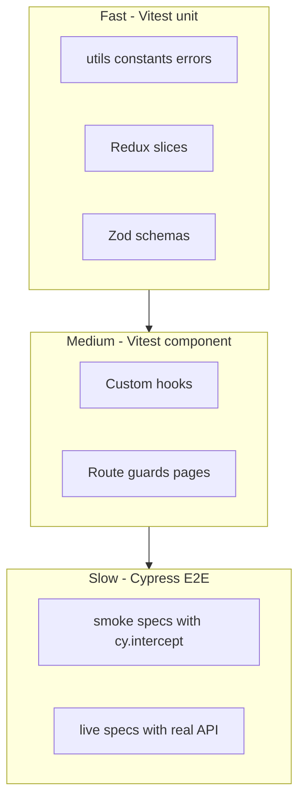

# Vitest + Cypress Testing Manual

This folder documents how testing is installed, configured, and used in the **my-react-groundup-manual** Vite app.

## Quick start

```bash
# Unit + component tests (watch)
npm test

# Unit tests (CI)
npm run test:run

# Coverage
npm run test:coverage

# Integration tests (requires backend on :3000)
npm run test:integration

# Cypress smoke E2E (starts dev server, mock API)
npm run test:e2e

# Cypress live API E2E (requires backend on :3000)
npm run test:e2e:live

# All automated tests
npm run test:all
```

## Test pyramid



## Documentation index

| Doc | Topic |
|-----|-------|
| [01_installation.md](./01_installation.md) | Packages and npm scripts |
| [02_vitest_configuration.md](./02_vitest_configuration.md) | Vitest + integration config |
| [03_cypress_configuration.md](./03_cypress_configuration.md) | Cypress setup and folders |
| [04_reusable_utilities.md](./04_reusable_utilities.md) | Shared helpers for new tests |
| [05_test_catalog.md](./05_test_catalog.md) | Every test file and what it covers |
| [06_running_tests.md](./06_running_tests.md) | Local dev, CI, troubleshooting |
| [07_adding_new_tests.md](./07_adding_new_tests.md) | Checklist when features grow |

## Related planning docs

- [2_ARCHITECTURE_SETUP_4_UI_PRIMITIVES.md](../manual/2_ARCHITECTURE_SETUP_4_UI_PRIMITIVES.md) — original Vitest/RTL/Cypress plan
- [3_AUTHENTICATION_HTTP_ONLY_SETUP.md](../manual/3_AUTHENTICATION_HTTP_ONLY_SETUP.md) — HTTP-only auth + live API testing notes
